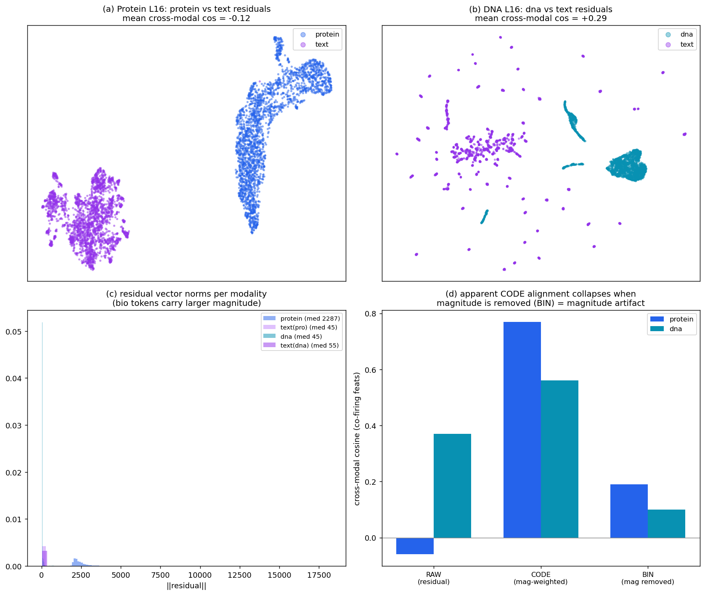

# Phase 3 SAE Interpretability — Cross-modal & Matryoshka Results

_BioReason SFT models (Qwen3-4B multimodal). Prepared 2026-07-02._

## TL;DR

1. **Cross-modal fusion is attention-mediated, not feature-level** — confirmed at *full dataset scale* on **both** protein and DNA. An SAE trained on the residual stream does not surface concept-level protein↔text or DNA↔text "fusion" features.
2. **Matryoshka / modality-weighting does NOT beat flat BatchTopK** on feature quality. Flat TopK/BatchTopK is the recommended recipe.
3. **Protein features are intrinsically weak** across every SAE variant (an ESM3-encoder property, not an SAE-method problem). **DNA is the far better substrate** (~12× stronger features).

---

## 1. Cross-modal: does the model bind protein/DNA to text at the feature level?

Metric: per-feature **φ co-activation** — does feature _k_ fire on the bio tokens AND the text tokens of the **same** samples, controlled for base rate? φ>0 = genuine cross-modal binding of a shared concept. (Raw-hidden cosine, à la SAE-V, is blind here because the modalities occupy different residual subspaces — φ in the shared SAE basis is the honest test.)

| Modality | Scale | Co-firing features | Selective, φ>0.3 | Verdict |
|---|---|---|---|---|
| **Protein** | **117,002 proteins** (full train, L24) | 73 | **0** | Clean null — no cross-modal binding |
| **DNA** | **36,088 samples** (full, L16) | 5,107 | **2** | Both non-semantic (see below) |

**The 2 DNA "survivors" are not concept binders:**
- **F15966** — a structural **boundary marker**: fires on DNA nucleotides and lands its text-side peak exactly on the DNA-END marker → first question word. Fires at the modality *junction*, not on a shared concept.
- **F16612** — a strong general **DNA-content** detector (act 13–16) that *leaks* weakly (act 5–8) onto genomic-identifier text (gene names, variant IDs). Not concept-specific on the DNA side.

**Why this matters:** DNA (unlike protein) *does* share residual subspace with text (raw cosine 0.37 vs ~0 for protein), so we expected DNA fusion features to be learnable. They are not — the subspace sharing is driven by these high-magnitude boundary/content features, not by concept binding. So the null holds even in the favorable case. Fusion in these models lives in attention, not in per-token residual features.

> **Open caveat (being tested):** the DNA SAE was trained **unbalanced** (98% DNA / 2% text — see §4), so text/cross-modal features got little gradient signal. The DNA null could partly reflect *under-trained text features* rather than a true absence of fusion. A **balanced DNA SAE** (70% DNA / 30% text) is training now; re-running φ on it is the rigorous control. The protein cross-modal result is *not* subject to this caveat — it used a balanced SAE.

## 2. Does Matryoshka / modality-weighting improve feature quality?

7-way comparison at L16 (all converged step-10000 checkpoints; identical shard sample; NIM-free metric = high peak activation + low firing frequency + wide token span, split by modality).

| Variant | HQ protein | HQ text | Note |
|---|---:|---:|---|
| **Flat BatchTopK** (`btk-only`) | **6** | **3513** | Best all-around |
| Modality-wt, uniform (`mw-uniform`) | 9 | 3226 | 9-vs-6 protein is within noise (single digits) |
| Modality-wt, protein-upweighted (`mw-coarse`) | 6 | 3257 | The variant *designed* to boost protein = **same as flat** |
| Modality-wt, fine (`mw-fine`) | 4 | 2996 | |
| Per-token Matryoshka (`matry-pertoken`) | 1 | 2187 | Worst — over-allocates weak protein features |
| BatchTopK-Matryoshka k64 (`mbtk-k64`) | 3 | 2448 | Starves minority modality |
| BatchTopK-Matryoshka k32 (`mbtk-k32`) | 1 | 983 | Low-k starves *everything* |

**Verdict:** neither nested-prefix Matryoshka nor per-prefix modality-weighting improves feature quality over plain flat BatchTopK. The protein-upweighted variant matched flat exactly, so the modality-weighting hypothesis is not supported. This corroborates the earlier autointerp result (flat detection-F1 0.522 > Matryoshka-BatchTopK 0.373). **Recommendation: flat TopK / BatchTopK.**

## 3. Protein feature weakness → DNA is the better substrate

Across all 7 variants, protein features stay weak (median peak activation 0.8–5.8) vs text (10–22). No architecture fixes it → it is specific to the ESM3 protein encoder (its per-token embeddings are near-collinear, self-cosine ~0.99), not an SAE problem.

BioReason-**DNA** (Evo2-1B → projector → Qwen3-4B) is a much better SAE target: token embeddings are far more varied (self-cosine 0.55), and its SAE features are **~12× stronger** (median max-activation 13.98 vs 1.18 for protein). The DNA L16 SAE dashboard is the more interesting artifact to browse.

---

## 4. Data & training statistics

Both models are Qwen3-4B (36 layers, hidden 2560); the SAE is trained on the residual stream at one layer. "Tokens" = kept (non-pad) activation rows in the store.

| | **Protein (BioReason-Pro)** | **DNA (BioReason-DNA)** |
|---|---|---|
| Bio encoder | ESM3 → 2-layer MLP projector | Evo2-1B (`blocks.20.mlp.l3`) → 2-layer MLP projector |
| Training corpus | CAFA-5, **117,002 proteins** (train split) | VEP non-SNV, **36,088 sequences** |
| SAE layer / store | L16 (also L18/20/22/24 extracted) | L16 |
| Store size | **421.3 M tokens** (2,110 shards) | **151.0 M tokens** (756 shards) |
| Modality mix (per token) | text 79.5% · **protein 14.9%** · go 5.6% | **dna 98.0%** · text 2.0% |
| **Exact token counts** | text **334,968,627** · protein **62,960,406** · go **23,400,400** (total **421,329,433**) | dna **147,960,800** · text **3,058,417** (total **151,019,217**) |
| **DNA sub-band counts** | — | dna_ref **≈73.98 M** · dna_variant **≈73.98 M** (exactly 50/50, matched pairs) · of the 3.06 M text: question **≈2.06 M** · answer **≈0.79 M** · reasoning **≈0.22 M** (empty `<think></think>`) |
| Per-prompt composition | variable (long reasoning prompts) | **DNA fixed ≈4100 tok** (ref+variant seqs, 2048 nt/side each) · question ≈57 · reasoning ≈6 (empty `<think></think>`) · answer ≈26 |
| Length caps (VEP) | text ≤10,000 · protein ≤2,000 · 200 go tokens | **DNA 2048 nt/side ×2 seqs** · text ≤1024 (LLM window 8192 only to fit raw DNA) |
| Reasoning content | prompt/reasoning/answer all populated | **VEP is answer-only** — `<think></think>` is empty (0/300 non-empty); chain-of-thought reasoning lives in the *separate KEGG task*, not VEP |
| Bio-token residual norm (median ‖·‖) | **≈ 2287** | ≈ 45 |
| Text-token residual norm (median ‖·‖) | ≈ 45 | ≈ 55 |
| SAE arch | TopK, expansion 16 → 40,960 latents, k=128, normalize-input/loss | same |
| **Modality balancing** | **`balance_modality=True`, protein-frac 0.5** (text down-sampled so protein ≈ 50% of the mix; `<go>` dropped) | **`balance_modality=False`** — raw 98/2 mix (bio-dominant *was* the intended target for max feature strength) |

Two consequences of the mix + balancing that matter for everything below:
- **The protein SAE was balanced; the DNA SAE was not.** So the DNA cross-modal null carries the "under-trained text" caveat in §1; the protein one does not. The balanced DNA SAE now training removes this asymmetry.
- **Protein bio-tokens carry ~50× the residual magnitude of text tokens** (median 2287 vs 45). DNA and text are comparable (45 vs 55). This magnitude gap is the crux of §6.

## 5. Methods we tried (glossary)

**SAE families**
- **Flat TopK** — the baseline. Keep the top-`k` latents *per token* (k=128); everything else zeroed. One flat dictionary of 40,960 features.
- **BatchTopK** — keep the top `k×batch` activations across the *whole batch* (not per token), with an EMA threshold at inference. Lets some tokens use more latents than others; usually a bit better reconstruction at matched sparsity.
- **Matryoshka SAE** — impose *nested prefixes* on the dictionary: the loss is summed over reconstructions that use only the first ½, ¼, ⅛, … of the latents (fixed groups `[0.5, 0.25, 0.125, 0.0625, 0.0625]`). Forces the earliest latents to be the most general/important — a coarse-to-fine code. **Per-token Matryoshka** (`matry-pertoken`) applies this with per-token TopK; **BatchTopK-Matryoshka** (`mbtk-k64`, `mbtk-k32`) combines nested prefixes with batch-level TopK at two sparsities (the "MAIRA-2" recipe).

**Balancing / loss-weighting techniques** (all aimed at the weak-minority-modality problem)
- **Modality balancing at load time** (`--balance-modality`) — no data rewrite; down-sample the *over-represented* modality per shard so the kept mix hits a target bio-fraction (`--balance-protein-frac`), and drop `<go>`. For protein this down-samples text (text is the majority); for DNA it down-samples DNA (the new `--bio-band dna` path — the majority there).
- **Per-prefix modality-weighted loss** (`mw-*`) — only with Matryoshka. Each nested prefix `b` gets its own convex loss `α_b·FVU_bio + (1−α_b)·FVU_text`, with tokens self-classified as bio/text via a calibrated direction. Variants: `mw-coarse` (bio up-weighted in the coarse prefixes: α=`0.8,0.65,0.5,0.5,0.5`), `mw-fine` (bio up-weighted in fine prefixes), `mw-uniform` (α=0.5 everywhere, i.e. a plain balanced control). The idea was to *reserve* coarse/global capacity for the weak bio modality. **Result (§2): it did not help** — the bio-up-weighted variant matched the flat baseline.

## 6. The cosine-vs-magnitude story (and why to be skeptical of it)

**What SAE-V actually computes (Algorithm 1).** Per feature `k`, SAE-V collects the tokens whose SAE activation `z_jk > δ`, keeps the top-K text tokens and top-K vision tokens (ranked by `z_jk`), and computes the mean pairwise cosine of their **raw hidden states `h_j`** — *not* the SAE codes. The SAE only *selects and ranks* which tokens participate; the vectors compared are the model's raw activations. So SAE-V's cross-modal weight `ω_k` **is** our `RAW_PT`. `CODE_PT` / `BIN_PT` / φ (below) are *our extensions* that probe the shared SAE feature basis — SAE-V never computes them.

This is the piece that's easy to over-read, so here is the full evidence rather than a one-liner. For features that fire on **both** modalities we measured the mean cosine of their top tokens in three representations, cross-modal (bio↔text, "PT") and within-modality (PP, TT) as positive controls:

| condition | what it is | **Protein L16** | **DNA L16** |
|---|---|---:|---:|
| **RAW_PT** | cosine of raw **residual** vectors, bio vs text | **−0.06** | **0.37** |
| RAW_PP / RAW_TT | raw residuals, within bio / within text | 0.99 / 0.54 | 0.66 / 0.48 |
| **CODE_PT** | cosine of **SAE code** vectors (magnitude-weighted), bio vs text | **0.77** | **0.56** |
| CODE_PP / CODE_TT | code vectors, within-modality | 1.00 / 0.97 | 0.69 / 0.69 |
| **BIN_PT** | cosine of **binarized** codes (fires / doesn't — magnitude removed), bio vs text | **0.19** | **0.10** |
| BIN_PP / BIN_TT | binarized, within-modality | 0.74 / 0.41 | 0.31 / 0.31 |

**The reasoning, step by step:**
1. **RAW_PT** ≈ 0 for protein (−0.06) and only 0.37 for DNA. In the raw residual stream, protein tokens are essentially **orthogonal** to text; DNA partially overlaps. So at the representation the SAE actually sees, there is little shared direction to bind onto — especially for protein.
2. **CODE_PT** looks encouraging (0.77 / 0.56) — "the features align after all!". **But CODE cosine is magnitude-weighted**: a handful of always-on, high-magnitude latents dominate the dot product. 
3. **BIN_PT** removes magnitude (just: does the latent fire, yes/no). It **collapses to 0.19 / 0.10**. So the *set* of latents a feature uses barely overlaps across modalities — the high CODE_PT was carried by the magnitudes of a few ubiquitous latents, **not** by a shared concept vocabulary.
4. Independently, the per-feature **φ co-activation** test (§1) — which asks whether a latent fires on bio and text of the *same samples*, base-rate-controlled — finds essentially **zero** selective cross-modal latents. φ and BIN agree.

**Why the magnitude confound is real and not hand-waving:** protein bio-tokens have **~50× the residual norm of text tokens** (median 2287 vs 45; §4). Any unnormalized/magnitude-weighted similarity is therefore dominated by whatever the bio tokens do, which is exactly the CODE-vs-BIN gap.

**Plain-language version of CODE vs BIN (shopping-cart analogy).** Think of each token's SAE code as a *shopping cart*. **CODE** cosine compares two carts by *dollars spent per aisle* — if both carts dump a lot into one shared aisle, they look similar even if everything else differs. **BIN** cosine compares by *which aisles were visited at all* (checklist, amounts ignored). We measure **CODE high (~0.6–0.8) but BIN low (~0.1)**: bio and text both pour large magnitude into a *handful of shared always-on latents* (e.g. features 23574/17954/35358 with mean-activation ~150, firing on 15–95% of tokens), but the actual *set* of latents they fire barely overlaps. So the apparent "alignment" is carried by the magnitude of a few loud features, **not** by a shared feature vocabulary.

> **Two distinct magnitude effects (don't conflate them):** (i) the **raw** residual norm gap — protein tokens ~50× text (§4) — is a property of the *raw* stream; because the SAE normalizes each token's input (`normalize_input`) and cosine is scale-invariant per vector, this gap does **not** drive CODE_PT. (ii) The CODE_PT inflation comes from a few **ubiquitous high-code-activation features** *within* the code vector. Both are "magnitude," but only (ii) causes the CODE≫BIN gap; (i) matters instead for why unnormalized reconstruction / balancing is dominated by protein.

**Picture — `analysis/crossmodal_geometry_umap.png`:**



- **(a) Protein**: UMAP (cosine metric) of protein vs text residuals — two **separated clouds** (mean cross-modal cos ≈ 0). Different subspaces.
- **(b) DNA**: dna vs text residuals **overlap** (cos ≈ 0.3). Shared subspace — yet still no semantic binding (§1).
- **(c) residual-norm histogram** — the *length* (‖vector‖) of each token's *raw* residual, one curve per modality. Protein tokens sit ~50× to the right (median 2287) of text (45); DNA (45) ≈ text (55). This is a fact about the *raw* stream (relevant to reconstruction/balancing); it is *not* what drives the CODE_PT gap in (d), since cosine is scale-invariant and the SAE normalizes its input.
- **(d) RAW / CODE / BIN cross-modal cosine bars** — three ways to ask "do bio & text features align?": RAW (raw residuals) ≈ 0; CODE (magnitude-weighted code) looks aligned; **BIN (which features fire, magnitude removed) collapses**. The gap between the CODE and BIN bars *is* the magnitude artifact, visualized.

**Robustness of the eq7 numbers:** the paper's cosine metric (top-K 5, δ=1) was re-run on **1,912 DNA samples** (exceeds SAE-V Table 5's 1,000); RAW/CODE/BIN came out 0.372 / 0.556 / 0.101 — **identical** to the earlier 383-sample run, so these are not small-sample artifacts. Note φ (§1) is our own co-activation metric, *not* the paper's cosine — we report both and they agree.

**Reasons to stay skeptical (stated plainly):**
- BIN cosine and φ are *sparsity-threshold-dependent* (τ=1.0). A different threshold could shift the co-firing set. We used the same τ across modalities, and the within-modality controls (PP/TT) behave sensibly, but it is one knob.
- "Orthogonal residuals" is measured on **co-firing** features' top tokens, not the whole stream; it's a statement about where these features live, not a global claim.
- The cleanest test doesn't rely on cosine geometry at all: **causal activation patching** (does patching bio activations into a text-only forward change the answer?). That's the recommended confirmation, and the **balanced DNA SAE** removes the training-imbalance objection to the DNA half. Until those land, treat §6 as *strong correlational evidence*, not proof.

### Why SAE-V's cosine works on vision-language models but ≈0 here

SAE-V validated on LLaVA-Next and Chameleon, where cross-modal cosine is high. The difference is **whether the two modalities are angularly aligned in the residual stream** — not whether we project. We *do* project protein embeddings into the text space (ESM3 → 2-layer MLP → Qwen 2560-dim), exactly like LLaVA — but **same dimensionality ≠ same directions**, and cosine measures direction.

| model | bio encoder pre-aligned to text? | fusion | cross-modal cosine |
|---|---|---|---|
| Chameleon | shared discrete token codebook (early fusion) | one space from layer 0 | works |
| LLaVA-Next | **yes** — CLIP is image↔text contrastive | projector | works |
| BioReason-Pro | **no** — ESM3 is protein-only, never sees text | projector | ≈ 0 (protein ⊥ text) |
| BioReason-DNA | partial — Evo2 is a sequence model (more language-like) | projector | 0.37 (in between) |

Two reasons the projection lands protein in a near-orthogonal region rather than aligned with text: (1) **ESM3 isn't text-aligned** (CLIP was trained on text; ESM3 wasn't), so the projector bridges an arbitrary gap with no directional-alignment pressure; (2) **the task only needs attention-readability** — the LLM reads protein via cross-attention, which requires protein tokens to be *addressable*, not *text-like in direction* (placing them in a distinct high-magnitude subspace is a fine solution, consistent with the 50× norm and ≈0 cosine; this part is a mechanistic hypothesis). Net: SAE-V's cosine assumes the LLaVA/Chameleon aligned-space regime, which does not hold for a protein encoder — so it structurally cannot see fusion here even if it exists, which is why we rely on φ / BIN in the shared feature basis instead.

## 7. The auto-interpret prompt (live dashboard button)

The 🔍 Auto-interpret button sends a feature's top-50 activation windows (peak token marked with `«…»`) to Llama-3.1-70B via NIM and asks for a structured label. The prompt is **domain-specific** — DNA and protein get different system prompts + KIND taxonomies (otherwise DNA features get force-fit into protein categories, e.g. everything → STRUCTURE). It also labels **each band separately** (dna / question / reasoning / answer, or protein / reasoning / answer).

**System prompt — DNA models:**
> You interpret a sparse-autoencoder feature of a DNA variant-effect-prediction LLM (Evo2 DNA embeddings fed into Qwen). The DNA side is nucleotide tokens (A/C/G/T k-mers, incl. ⟦S⟧/⟦E⟧ segment markers); the text side is a variant QUESTION (e.g. '...chromosome 1 position 1040717, gene AGRN: benign or pathogenic?') and a short ANSWER (e.g. 'Answer: pathogenic; Congenital myasthenic syndrome'). «token» marks where the feature fires HARDEST. Name the SPECIFIC token/pattern; do NOT give a generic category.

**System prompt — protein models:**
> You interpret a sparse-autoencoder feature of a protein-reasoning LLM. Its reasoning/answer text frequently PRINTS Gene-Ontology term names (e.g. 'cytosol', 'protein binding') and GO accessions (e.g. 'GO:0005737'). «token» marks where the feature fires HARDEST. Do NOT give a generic biological category — name the SPECIFIC token/pattern, and judge whether it is merely firing on a printed GO term/accession (label-reading) vs genuine reasoning.

**User message (both):**
```
This feature's PEAK token (what it fires hardest on) across the windows: {peak_tokens}.
Windows (« » = peak):
  - {window 1}
  - {window 2}
  ... (up to 50)

Reply in EXACTLY this format:
TRIGGER: <the specific token or short pattern it fires on>
{KIND line — see taxonomy below}
MEANING: <ONE precise, non-generic sentence>
```

**KIND taxonomy:**
- **DNA:** `NUCLEOTIDE-MOTIF | GENE-NAME | VARIANT-COORD | VERDICT | DISEASE-NAME | STRUCTURE`
- **Protein:** `GO-TERM-TEXT | ACCESSION | REASONING | STRUCTURE | PROTEIN` (GO-TERM-TEXT/ACCESSION flag label-reading vs genuine reasoning)

Settings: `temperature=0.1`, `max_tokens=130`, top-50 windows, ±8-token context. Source: `scripts/autointerp_server.py`.

---

## Artifacts

- Protein cross-modal (full 117k, L24): `multimodal_dashboard/public/crossmodal/crossmodal_l24_matryoshka_full.json`
- DNA cross-modal (full 36k, L16): `/data/savithas/dna_sae/crossmodal_dna_FULL.json`
- Matryoshka quality atlases (7 variants): `/data/savithas/phase3_full/qual_atlas/<variant>/`
- Cross-modal geometry figure + script: `analysis/crossmodal_geometry_umap.png`, `scripts/geometry_umap.py`
- Geometry tables (RAW/CODE/BIN): `scripts/eq7_verify.py` logs (`eq7_dna_ep3final_8sh.log`, `eq7_verify_l16*.log`)
- Balanced DNA SAE (control, in progress): `/data/savithas/dna_sae/sae-dna-l16-vep-balanced/`
- DNA feature dashboard: `?model=dna_l16_vep` (live auto-interpret button; per-band dna/text — question/answer split being added)

## Next steps

**1. Causal activation patching.** The one experiment that would give *positive* evidence for where fusion lives — patch bio-token activations into a text-only forward and measure the answer shift. Both cross-modal verdicts point to attention-mediated fusion; patching would confirm the mechanism directly. Scoped but not yet run.

**2. Alignment as the missing ingredient (the key follow-up).** Our whole cross-modal result reframes to a testable claim: **SAE cross-modal features require a representation where the two modalities are *directionally aligned*.** SAE-V's cosine (and, we argue, feature-level fusion itself) works on LLaVA-Next / Chameleon because their image tokens are angularly aligned with text — CLIP is image↔text contrastive, Chameleon shares a token space (§6). BioReason-Pro's projector was never given that alignment pressure — it only had to make protein tokens *attendable* — so protein lands in a near-orthogonal subspace and no cross-modal features form.

The natural fix is to add the **CLIP piece** that's missing. [**Prot2Text-V2**](https://arxiv.org/abs/2505.11194) (Protein Function Prediction with Multimodal Contrastive Alignment) is almost exactly BioReason's architecture — ESM-3B → lightweight nonlinear projector → LLaMA-3.1-8B — *plus* **H-SCALE**, a CLIP-style contrastive stage that aligns pooled protein embeddings with their text descriptions before instruction tuning. That's the protein analog of CLIP: it should move protein from the "not aligned → cosine ≈ 0" regime toward the "aligned → cosine meaningful" regime.

Concrete experiments, cheapest first:
- **Run our existing SAE pipeline on an aligned model (Prot2Text-V2 or similar).** No retraining on our side — a *domain-matched* aligned control (same modalities as BioReason, but with alignment), isolating "alignment" as the variable rather than "protein vs images." Does an aligned bio-text model yield the cross-modal SAE features BioReason-Pro lacks?
- **Add a contrastive alignment stage to BioReason's projector** (H-SCALE-style: align protein-token reps with GO/function text), then re-run the SAE + φ.

Both outcomes are publishable: fusion features appear under alignment → *"alignment is the prerequisite for cross-modal SAE features in bio models"*; they still don't → *"even sequence-level alignment doesn't induce per-token feature fusion"* (a deeper statement about attention-mediated integration). Caveat: H-SCALE aligns at the **sequence level** (pooled), so whether it induces *per-token* cross-modal features is exactly the open question.
