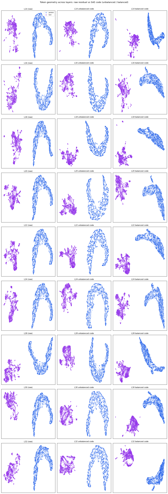

# Modality balancing across layers (BioReason-Pro)

*Savitha S. — July 2026 · companion to the main proposal*

A quick cross-layer check on the balancing result from the proposal: does modality loss-balancing create protein-selective SAE features at *every* layer, or is layer 16 special? I trained a matched pair of SAEs — unbalanced (~2% protein, the natural mix) vs balanced (~50/50 protein:text) — at nine layers, and measured per-feature modality selectivity on the same protein+text token sample.

A feature is **protein-selective** if it fires on >1% of protein tokens and <0.1% of text tokens (top-left corner of the scatter), and **text-selective** the other way around.

## Result: balancing creates a protein vocabulary at every layer

| Layer | protein-selective (unbal → bal) | text-selective (unbal → bal) |
|------:|:-------------------------------:|:----------------------------:|
| L14   | 27 → **572**  | 1787 → 1395 |
| L16   | 12 → **650**  | 1972 → 2248 |
| L18   | 15 → **714**  | 2564 → 2469 |
| L20   | 21 → **646**  | 2735 → 2403 |
| L22   | 13 → **764**  | 2360 → 2223 |
| L24   | 34 → **928**  | 2009 → 1893 |
| L28   | 31 → **709**  | 3107 → 2773 |
| L30   | 12 → **663**  | 1741 → 2888 |
| L32   |  9 → **655**  | 1393 → 3171 |

The effect is robust and layer-independent: unbalanced, protein gets a couple dozen dedicated features at best; balanced, it gets **~570–930**, a 20–50× increase, at every layer. The peak is around **L24** (34 → 928), and the mid-stack layers (L22–L24) are the richest. Text-selective counts stay in the same ballpark — balancing isn't starving text, it's carving out capacity the natural mix never gave protein.

*(Measured on a 2,000-protein-token + 2,000-text-token sample per layer; counts scale with the sample but the unbal→bal ratio is stable. "Selective" here means near-exclusive firing, so these numbers are stricter — and smaller — than the "protein-heavy feature" count in Figure 1 of the proposal.)*

> **Per-feature modality selectivity across layers.** Left column = unbalanced loss, right column = balanced. Each dot is a feature; x = fraction of text tokens it fires on, y = fraction of protein tokens. The dense stripe up the left edge of every balanced panel is the protein-selective population — nearly absent in every unbalanced panel.

## Token geometry across layers (raw vs SAE)

Balancing changes *which* features carry protein (above), but it doesn't change where the tokens sit. At every layer, protein and text separate in the raw residual stream, and the SAE codes inherit that separation whether the loss is unbalanced or balanced. The modality split is a property of the encoder that the SAE preserves at all depths — which is the same reason the raw-activation cross-modal metric reads near zero throughout (see the main proposal).

> **Token geometry across layers.** Rows = layers (L14–L32); columns = raw residual, unbalanced SAE code, balanced SAE code (same protein+text tokens, UMAP). Blue = protein, purple = text. Protein and text form separate regions in every panel — the separation is there in the raw residuals and survives encoding regardless of balancing.

## A representational limit on the protein side

Balancing gives protein more *dedicated features*, but it does not make individual protein tokens more *distinguishable from each other*. Measuring, at layer 16, how many distinct features each modality uses and how spread out its codes are (mean pairwise cosine distance):

| | distinct features used: protein | text | code spread: protein | text |
|---|---:|---:|---:|---:|
| unbalanced | 232 | 15,797 | 0.007 | 0.358 |
| balanced   | 1,277 | 9,479 | 0.006 | 0.024 |

Two things stand out. First, the wide text spread under the unbalanced loss (0.358) is text monopolising the dictionary — text tokens activate essentially the whole live dictionary (~15,800 features) and are finely differentiated, while protein is squeezed into ~232 and collapses. Balancing reclaims that capacity for protein (232 → 1,277 distinct features).

Second, and more important: **protein code spread stays near zero in both cases (~0.006), even with 5.5× more protein features.** This is the ESM3 signature — protein token embeddings are nearly collinear (self-cosine ~0.99), so every protein token's code is dominated by the same high-magnitude component. The signal that separates one protein from another is real but small (enrichment tests still find protein-selective features, e.g. a protein-kinase feature at p=3.6e-14), just swamped per-token.

This is a limitation of the *encoder*, not the SAE, and it reframes our Matryoshka result. Matryoshka (with modality-weighting) never surfaced cross-modal features — the null held just as it did for flat — and if anything it made the minority modality worse: its BatchTopK objective *starved* protein, giving roughly 15× fewer protein features than flat TopK and concentrating capacity on text. MAIRA-2's Matryoshka-SAE (Bouzid, Bannur et al., ICML 2025) produced clean, interpretable clinical concepts (not cross-modal-fusion features) because its image encoder is text-aligned and high-diversity; ours couldn't match that because the protein representation is collapsed and unaligned. So the bottleneck isn't the SAE variant — it's the encoder, which is exactly why the alignment experiment (Prot2Text-V2) and a per-modality expert that whitens off the shared component are the right next moves.

## How much to balance? The split sweep

The results above use a ~50/50 mix. To find the sweet spot I swept the protein fraction in the training mix (layer 16): ~2% (natural/unbalanced), 30, 40, 50, 60, 70%.

> **Balance-split sweep at layer 16.** *Left:* protein-selective features climb to a plateau at ~50–60% protein (664 → 666) then fall off at 70%; text-selective peaks at 50% then collapses. *Right:* dead latents rise monotonically past ~40% protein, reaching ~46% at 70%. The sweet spot is **~50–60% protein** — enough to give protein real capacity without wrecking the dictionary. Past 60% you lose protein features *and* nearly half the dictionary dies (the low-diversity ESM3 embeddings can't fill a protein-dominated dictionary).
