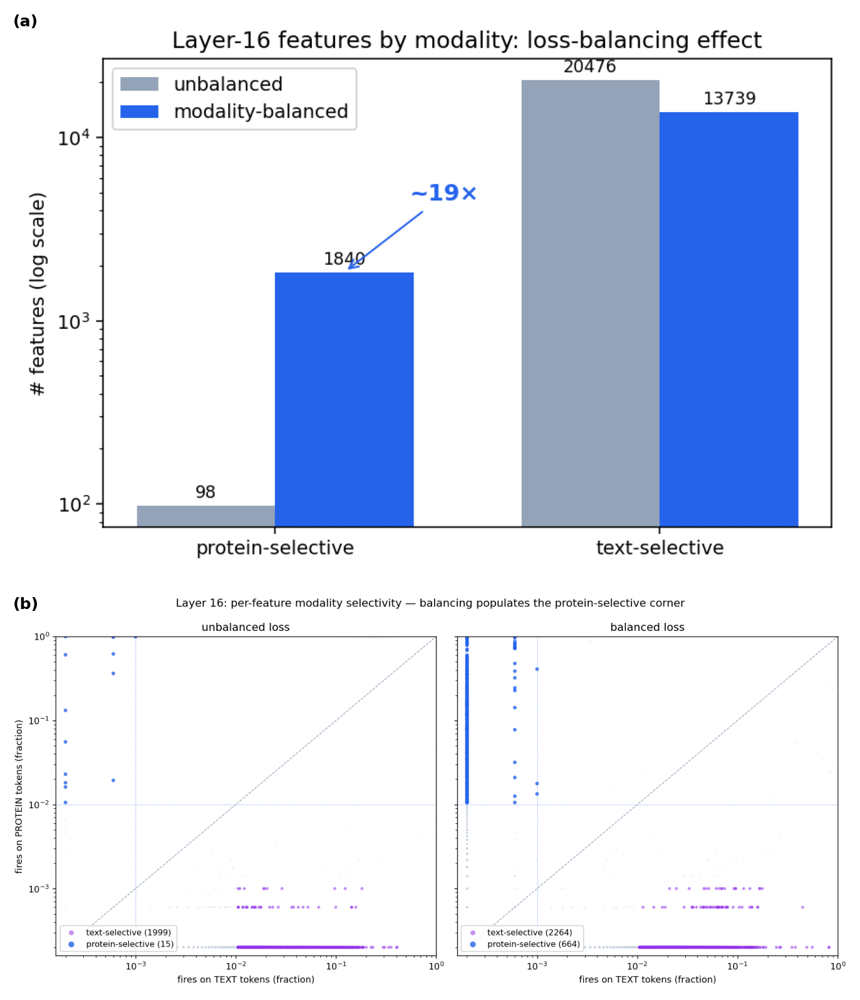

# Sparse Autoencoders for Biology–Language Models

*Savitha S. — July 2026*

## Motivation

Extending SAEs to multimodal models is a nascent field: most notable work in this space has been done on vision–language models. To our knowledge, there is no prior work on applying SAEs to biology–language fusion models, i.e., BioReason-style models where a protein or DNA foundation model that has never seen text is fused into an LLM. Indeed, the Orlov et al. bio-SAE systematic review (bioRxiv, March 2026) names "scaling SAE analysis to multimodal architectures" as a top-4 field priority within digital biology, signaling that this is a high-impact area to research and publish in. The two nearest precedents are both vision-language: SAE-V (Lou et al., ICML 2025) on general vision-language MLLMs, whose cross-modal feature-weighting metric we lift directly; and a Matryoshka-SAE study of the radiology model MAIRA-2 (Bouzid, Bannur et al., ICML 2025), which pulled clinically meaningful concepts — pleural effusion, cardiomegaly, medical devices — out of a domain-specialised MLLM.

This gap is worth closing for a few reasons. First, these models raise a question no one has answered: when we fuse a biology encoder into an LLM (BioReason = Evo 2 + Qwen; BioReason-Pro = ESM3 + Qwen; Peter's DNA-tokenizer MoE on Nemotron), how deeply do the two modalities actually integrate — does the model build features that genuinely mix biology and language, or does it keep them in separate representations and combine them only through attention? SAEs are the most direct way to determine this. Second, this could also offer our team insight into how multimodal fusion models reason as compared to traditional tool-calling methods. Finally, the recipe and learnings from applying an SAE to BioReason-Pro will be directly applicable to the multimodal models being developed on our team by Peter and John.

## Initial learnings and results

I built the full pipeline on BioReason-Pro (ESM3 + Qwen) — activation extraction, SAE training, and feature interpretation. Some key learnings from my work so far:

- **Balancing the modalities is what makes a bio-LLM SAE work.** Protein tokens are ~50× larger in norm than text and are a small slice of the data, so a naively trained SAE mostly ignores them. Rebalancing the training mix to ~50/50 protein:text raises the number of protein features from ~100 to ~1,800 (Figure 1a); at the individual-feature level, the protein-selective region of the dictionary goes from nearly empty to populated (Figure 1b). This holds at every one of the nine layers I tested — a 20–50× increase in protein-selective features. I'm currently testing other balancing ratios.

> **Figure 1.** The balancing effect, two views. **(a)** Layer-16 feature counts by modality: protein-selective features rise ~100 → ~1,800 with modality balancing. **(b)** The same effect per feature — x = fraction of text tokens a feature fires on, y = fraction of protein tokens; protein-selective features live in the top-left, and balancing fills that corner (~15 → ~660).

- **The SAE surfaces interpretable reasoning features.** I built an interpretation pipeline that first splits each example into bands — prompt, question, reasoning, and answer text (and, for the DNA model, reference vs variant sequence) — so a feature is labeled by *where* it fires and reasoning features are separated from prompt/answer boilerplate. Labeling is domain-aware (distinct protein vs DNA concept taxonomies) and flags purely syntactic or polysemantic features. This surfaces clean concepts on the text side — a "cell junction" feature, an "embryonic development" feature, a "transport / localization" feature. For **protein** features I ground the labels in biology rather than tokens: a Fisher exact over-representation test on GO terms and UniProt keywords/domains, run over the proteins a feature fires on against a background set, which recovers real signal (e.g. a protein-kinase feature at p = 3.6e-14). The protein side is still the weak point — many features fire too often to trust, and the labeler keys on a feature's single strongest token — so I treat protein labels as candidates to verify, and hardening this is the main remaining work.

- **So far, using the SAE-V framework, I haven't found any cross-modal (fusion) features — the most interesting result.** Searching for features that tie a biological concept to its text turns up only structural markers. As for why this might be, we hypothesize it's because the protein and text feature spaces are close to orthogonal — the SAE inherits that separation regardless of balancing (Figure 2a), so the cross-modal metric reads near zero by construction (Figure 2b; the DNA model overlaps somewhat more). To check whether there's another cause, I'm also establishing an SAE-V baseline in our bionemo recipe code — reproducing their published vision-language result — to confirm the implementation is correct and the null isn't a method or code artifact. A further hypothesis to test is that feature-level fusion needs a *text-aligned* encoder (as in the CLIP-based vision-language models where fusion does appear), which I can check by running the same pipeline on a text-aligned protein model. I'm also experimenting with other modalities like DNA, to see whether this hypothesis holds more broadly or the null is an artifact of the BioReason-Pro dataset.

> **Figure 2.** Why the metric reads near zero. **(a)** Same tokens, raw vs SAE (UMAP): the raw residual already separates the modalities, and the SAE codes inherit it whether the loss is unbalanced or balanced — balancing changes *which* features carry protein, not the token-level geometry. **(b)** Layer-16 activations: protein (ESM3) and text form near-separate clusters, while DNA (Evo 2) and text overlap more — so a raw-activation cross-modal metric reads near zero for an encoder never aligned to text.

## Next steps

- **Refine the BioReason SAE features and the autointerp pipeline.** Harden the protein-feature interpretation (filter high-frequency/low-quality features, fix the single-strongest-token labeler) and ground protein features in structure via AlphaFold / OpenFold. Looking more closely at the reasoning features and understanding the underlying biology better may also surface other ways to identify cross-modal features that the current metric misses.
- **Test the alignment hypothesis for the SAE-V framework.** Run the same pipeline on a text-aligned protein model — **Prot2Text-V2** (same protein encoder → adapter → LLM shape as BioReason, but trained to align protein and text); cross-modal features there but not in BioReason would confirm alignment is the deciding factor. Reproduce SAE-V on LLaVA-Next as a known-positive control, and check the DNA model to see whether the null is dataset-specific.
- **Develop a modality-aware SAE architecture.** My balancing and Matryoshka experiments were a first pass, and Matryoshka didn't beat flat BatchTopK here — so the next step is an architecture built for the modality issues we're actually seeing, e.g. a mixture-of-experts SAE with an expert per modality plus a shared "fusion" expert, giving each modality its own capacity and making cross-modal fusion something we can measure rather than hunt for.

## Deliverable

The first two results would already make a great blog post or short workshop paper — the first SAE interpretability study of a biology–language fusion model (cf. Goodfire's [*Under the Hood of a Reasoning Model*](https://www.goodfire.ai/blog/under-the-hood-of-a-reasoning-model) and the MAIRA-2 radiology study). If we can get an interesting story or results out of the alignment test or a new architecture, this could grow into a full-scale paper. Another avenue worth exploring is comparing the SAE interpretability results against pure attention for a model like BioReason-Pro.
