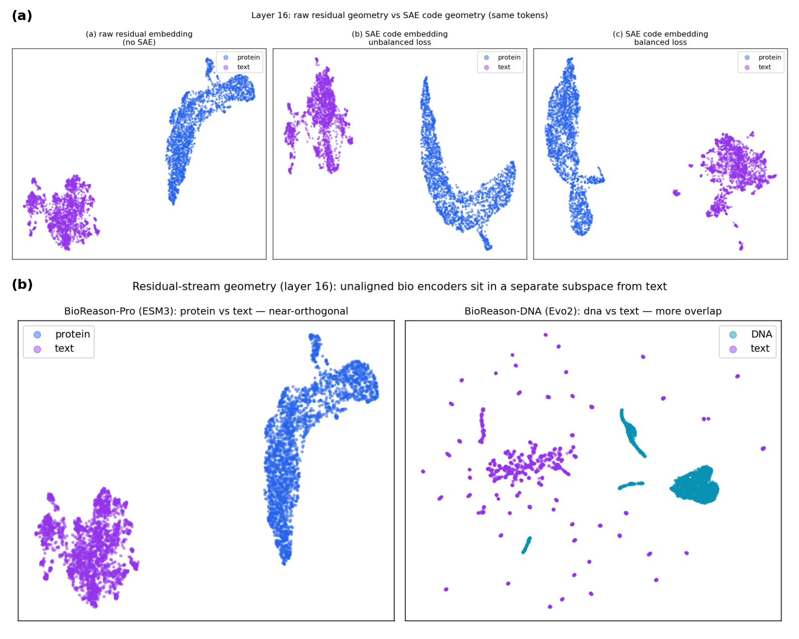

# Sparse Autoencoders for Biology–Language Models

*Savitha S. — July 2026*

## Motivation

Extending SAEs to multimodal models is a nascent field: most notable work in this space has been done on vision–language models. To our knowledge, there is no prior work on applying SAEs to biology–language fusion models, i.e., BioReason-style models where a protein or DNA foundation model that has never seen text is fused into an LLM. Indeed, the Orlov et al. bio-SAE systematic review (bioRxiv, March 2026) names "scaling SAE analysis to multimodal architectures" as a top-4 field priority within digital biology, signaling that this is a high-impact area to research and publish in. The two nearest precedents are both vision-language: SAE-V (Lou et al., ICML 2025) on general vision-language MLLMs, whose cross-modal feature-weighting metric we lift directly; and a Matryoshka-SAE study of the radiology model MAIRA-2 (Bouzid, Bannur et al., ICML 2025), which pulled clinically meaningful concepts — pleural effusion, cardiomegaly, medical devices — out of a domain-specialised MLLM.

This gap is worth closing for a few reasons. First, these models raise a question no one has answered: when we fuse a biology encoder into an LLM (BioReason = Evo 2 + Qwen; BioReason-Pro = ESM3 + Qwen; Peter's DNA-tokenizer MoE on Nemotron), how deeply do the two modalities actually integrate — does the model build features that genuinely mix biology and language, or does it keep them in separate representations and combine them only through attention? SAEs are the most direct way to determine this. Second, this could also offer our team insight into how multimodal fusion models reason compared to traditional tool-calling methods. Finally, the recipe and learnings from applying an SAE to BioReason-Pro will be directly applicable to the multimodal models being developed on our team by Peter and John.

## Initial learnings and results

I built the full pipeline on BioReason-Pro (ESM3 + Qwen) — activation extraction, SAE training, and feature interpretation. Some key learnings from my work so far:

**1. Balancing the modalities is what makes a bio-LLM SAE work.** Protein tokens are ~50× larger in norm than text and are a small slice of the data, so a naively trained SAE mostly ignores them. Rebalancing the training mix to ~50/50 protein:text raises the number of protein features from ~100 to ~1,800; at the individual-feature level, the protein-selective region of the dictionary goes from nearly empty to populated (Figure 1). This holds at every one of the nine layers I tested — a 20–50× increase in protein-selective features. I'm currently testing other balancing ratios.

> **Figure 1.** Per-feature modality selectivity at layer 16. Each dot is a feature: x = fraction of text tokens it fires on, y = fraction of protein tokens. Protein-selective features (blue, top-left) rise from ~15 under the unbalanced loss to ~660 when balanced — balancing gives protein its own dictionary rather than forcing it onto text-owned features. (This panel uses a stricter *near-exclusive* definition than the ~100 → ~1,800 count above — a feature must fire almost only on protein — hence the smaller absolute numbers; the ~20× jump is the same effect.)

**2. The SAE surfaces interpretable reasoning features.** The pipeline splits each example into bands (prompt, question, reasoning, answer — and reference vs variant for the DNA model) so a feature is labeled by *where* it fires, then auto-labels each with a 70B-instruct model served through a NIM. It surfaces clean reasoning concepts — a "cell junction" feature, an "embryonic development" feature, a "transport / localization" feature. Protein-band features fire often enough to be meaningful (log-frequency > −3) but at low activation (< 5), so they need more interpretation — they are candidates for now.

**3. So far, using the SAE-V framework, I haven't found any cross-modal (fusion) features.** We hypothesize it's because the protein and text feature spaces are close to orthogonal — the SAE inherits that separation regardless of balancing (Figure 2a), so the cross-modal metric reads near zero by construction (Figure 2b; the DNA model overlaps somewhat more). To check whether there's another cause, I'm also establishing an SAE-V baseline in our bionemo recipe code — reproducing their published vision-language result — to confirm the implementation is correct and the null isn't a method or code artifact. A further hypothesis to test is that feature-level fusion needs a text-aligned encoder (as in the CLIP-based vision-language models where fusion does appear), which I can check by running the same pipeline on a text-aligned protein model. I'm also experimenting with other modalities like DNA, to see whether this hypothesis holds more broadly or the null is an artifact of the BioReason-Pro dataset.

> **Figure 2.** Why the metric reads near zero. **(a)** Same tokens, raw vs SAE (UMAP): the raw residual already separates the modalities, and the SAE codes inherit it whether the loss is unbalanced or balanced — balancing changes *which* features carry protein, not the token-level geometry. **(b)** Layer-16 activations: protein (ESM3) and text form near-separate clusters, while DNA (Evo 2) and text overlap more — so a raw-activation cross-modal metric reads near zero for an encoder never aligned to text.

## Next steps

- **Refine the BioReason SAE features and the autointerp pipeline.** There is still work to make the protein-side interpretation trustworthy: I want to filter out the high-frequency, low-quality features and improve the autointerp labeler — the 70B-instruct model served through a NIM — which currently keys on a feature's single strongest token and misses recurring phrases. I also want to ground protein features in structure by mapping them onto AlphaFold / OpenFold predictions. Looking more closely at the reasoning features, and understanding the underlying biology better, may also point to ways of spotting cross-modal features that the current metric misses.
- **Test the alignment hypothesis behind the SAE-V framework.** The cleanest test is to run the same pipeline on a protein model that was actually trained to align its two modalities — Prot2Text-V2, which shares BioReason's protein-encoder → adapter → LLM shape but was explicitly trained to align protein and text. If cross-modal features show up there but not in BioReason, alignment is likely the deciding factor. Alongside it, I would reproduce SAE-V on LLaVA-Next as a known-positive control, and run the DNA model to check whether the null is specific to the BioReason-Pro dataset.
- **Develop a modality-aware SAE architecture.** My balancing and Matryoshka experiments were a first pass, and since Matryoshka didn't beat flat BatchTopK here, the next step is an architecture designed for the modality imbalance we're actually seeing. The idea I want to try is a mixture-of-experts SAE — an expert per modality plus a shared "fusion" expert — which would give each modality its own capacity and turn cross-modal fusion into something we can measure directly rather than hunt for.

## Deliverables

Completing the first two next steps would make a substantial blog post or short workshop paper — the first SAE interpretability study of a biology–language fusion model (cf. Goodfire's [*Under the Hood of a Reasoning Model*](https://www.goodfire.ai/blog/under-the-hood-of-a-reasoning-model) and the MAIRA-2 radiology study). If those produce an interesting enough story, or the modality-aware architecture works out, this could grow into a full-scale paper. Another avenue worth exploring is comparing the SAE interpretability results against pure attention for a model like BioReason-Pro.
