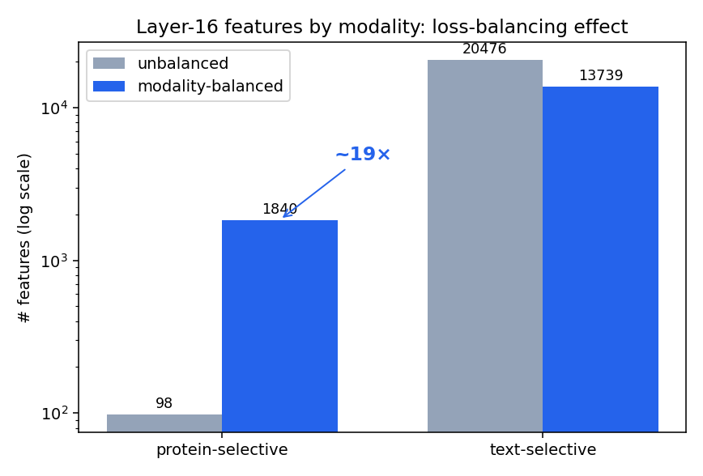
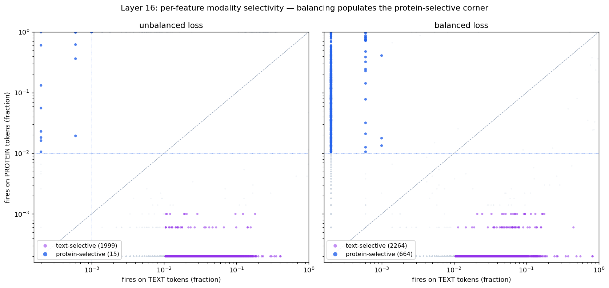
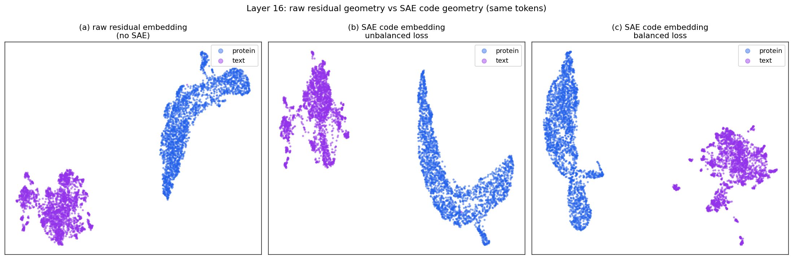
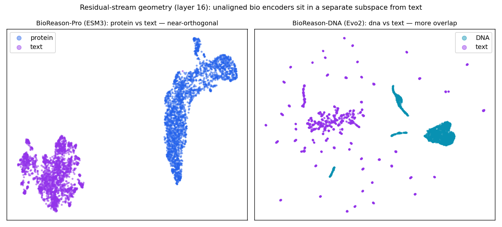

# Sparse Autoencoders for Biology–Language Models

*Savitha S. — July 2026*

## Background

Sparse autoencoders (SAEs) are the standard tool for pulling interpretable, monosemantic features out of a transformer's activations. Over the past year they've been extended to multimodal models, but only vision–language ones. The two nearest precedents are both vision-language: SAE-V (Lou et al., ICML 2025) on general vision-language MLLMs, whose cross-modal feature-weighting metric we lift directly; and a Matryoshka-SAE study of the radiology model MAIRA-2 (Bouzid, Bannur et al., ICML 2025), which pulled clinically meaningful concepts — pleural effusion, cardiomegaly, medical devices — out of a domain-specialised MLLM. Both fuse an *image* encoder that was trained against text. We haven't found any prior work applying SAEs to **biology–language fusion models**, where a protein or DNA foundation model that has never seen text is fused into an LLM — and, as it turns out, that difference is the crux of the results below. The Orlov et al. bio-SAE systematic review (bioRxiv, March 2026) names "scaling SAE analysis to multimodal architectures" as a top-4 field priority and doesn't even consider biology + natural-language fusion.

MAIRA-2 also sets the bar we're aiming at: interpretable, domain-meaningful multimodal features. The equivalent for us is features tied to protein function.

That gap is worth closing for two reasons. **Scientifically**, these models raise a question no one has answered: when we fuse a biology encoder into an LLM (BioReason = Evo 2 + Qwen; BioReason-Pro = ESM3 + Qwen; Peter's DNA-tokenizer MoE on Nemotron), how deeply do the two modalities actually integrate — does the model build features that genuinely mix biology and language, or does it keep them in separate representations and combine them only through attention? SAEs are the most direct way to look inside and tell which. **Practically**, that bears on how a fusion model earns its cost over a cheaper pipeline that serializes a bio tool's output to text and reasons over that. Shared bio+text features would be strong evidence the model does something a tool-call can't; their absence wouldn't rule out value — conditioning on the encoder's rich embedding through attention can still beat a lossy text hand-off — but it tells us the integration is shallower than the architecture implies, which is worth knowing before we invest further. Either way, the methods this work produces carry straight to our own multimodal models.

## Proposed outcome

Two results are already in hand, and together they're enough for a blog post or short workshop paper:

1. a training recipe and the modality-balancing method that make an SAE represent both modalities at all; and
2. the mechanistic result on whether — and where — these models fuse biology and language.

A third contribution, a modality-aware mixture-of-experts SAE, is a bonus: if it works, it grows this into a full paper. Either way the recipe and methods are model-agnostic, so they're useful for the team's own multimodal models.

There's real community appetite for this kind of writeup. Goodfire's [*Under the Hood of a Reasoning Model*](https://www.goodfire.ai/blog/under-the-hood-of-a-reasoning-model) interpreted DeepSeek-R1 with SAEs and drew a lot of interest; ours would be the first to do it on a *biology* reasoning model and tie the features back to protein function. Natural venues are mechanistic-interpretability and bio-ML workshops.

## Work so far

I built the full pipeline on BioReason-Pro (ESM3 + Qwen) — activation extraction, SAE training, and feature interpretation. Two results are solid; one is preliminary.

**Balancing the modalities is what makes a bio-LLM SAE work.** Protein tokens are ~50× larger in norm than text and are a small slice of the data, so a naively trained SAE mostly ignores them. Rebalancing the training mix to ~50/50 protein:text raises the number of protein features from ~100 to ~1,800 (Figure 1); at the individual-feature level, the protein-selective region of the dictionary goes from nearly empty to populated (Figure 2). This holds at every one of the nine layers I tested — a 20–50× increase in protein-selective features, peaking around layer 24 — so it's a property of the method, not a lucky layer. It's a method I can reuse on other models.

> **Figure 1.** Modality loss-balancing at layer 16: protein-selective features rise ~100 → ~1,800, and the modalities separate cleanly rather than the dictionary being dominated by text.

> **Figure 2.** The same effect per feature: x = fraction of text tokens a feature fires on, y = fraction of protein tokens. Protein-selective features live in the top-left. The unbalanced loss leaves that corner nearly empty (~15 features); balancing fills it (~660).

**The model does not appear to fuse the modalities at the feature level — the most interesting result.** Looking for features that tie a biological concept to its text, I find only structural markers. The cross-modal metric (from SAE-V) compares the model's raw activations, and in BioReason-Pro the protein and text activations point in almost entirely separate directions — the SAE inherits that separation regardless of balancing (Figure 3), so the metric reads near zero by construction (Figure 4; the DNA model overlaps somewhat more). This looks like a property of the encoder, not the method: the vision–language models where fusion showed up use encoders trained against text (CLIP), whereas ESM3 and Evo 2 have never seen text. My working hypothesis is that feature-level cross-modal fusion only emerges once the two modalities are actually aligned — and that is directly testable.

> **Figure 3.** Same tokens, raw vs SAE (UMAP). The raw residual (a) already separates the modalities; the SAE codes inherit it whether the loss is unbalanced (b) or balanced (c). Balancing changes *which* features carry protein, not the token-level geometry.

> **Figure 4.** Layer-16 activations. Protein (ESM3) and text form near-separate clusters (left); DNA (Evo 2) and text overlap more (right) — which is why a raw-activation cross-modal metric reads near zero for an encoder never aligned to text.

**Preliminary: the SAE surfaces interpretable reasoning features.** My interpretation pipeline labels a feature by the proteins it fires on and what they have in common, and it finds clean concepts — a "cell junction" feature, an "embryonic development" feature, a "transport / localization" feature. The protein-side labels are still weak (many features are low-quality or fire too often), so I treat these as candidates to verify, not conclusions.

## Next steps

The main next experiment is to test the alignment hypothesis directly, by running the same pipeline on **Prot2Text-V2**, which has BioReason's shape (protein encoder → adapter → LLM) but was explicitly trained to align protein and text. Cross-modal features appearing there but not in BioReason would confirm that alignment is the prerequisite for feature-level fusion. Baselines alongside it: reproduce SAE-V on LLaVA-Next to confirm the metric behaves, and run the DNA model.

In parallel I want to build a **modality-aware SAE architecture** — a mixture-of-experts SAE with an expert per modality plus a shared "fusion" expert — so each modality gets its own capacity and cross-modal fusion becomes something we *measure* (does the fusion expert fire?) rather than hunt for. Balancing and Matryoshka were a first pass and point to a structural fix rather than another loss tweak. Complementary threads: how reasoning features evolve across layers, how SAE features compare to attention, and grounding protein features in structure via AlphaFold / OpenFold.

## Risks

The alignment hypothesis may not hold — cross-modal features might fail to appear even in Prot2Text-V2 — but that is itself a clean, publishable result about *when* feature-level fusion is possible. The MoE-SAE may not beat flat balancing (Matryoshka didn't), in which case the contribution is the recipe and the negative architectural result. Protein-feature interpretation is currently weak and needs the labeler hardened. Even if the fusion story turns out negative, though, the recipe, the balancing method, and the "bio encoders aren't text-aligned" finding still transfer to our own models and hold up on their own.
