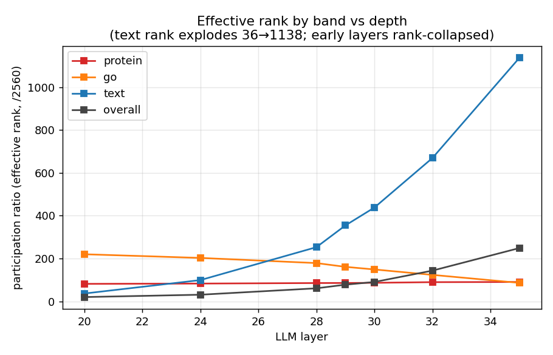
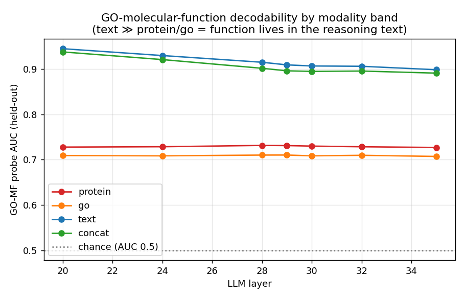
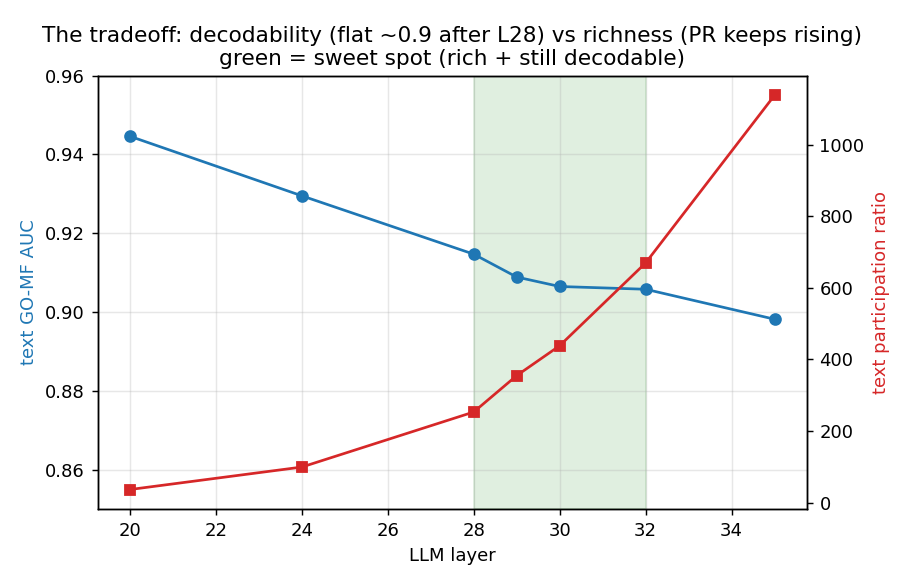
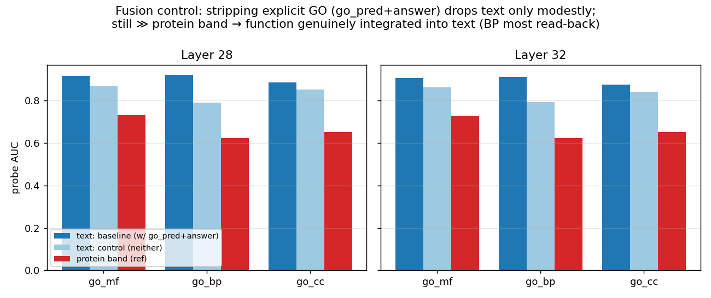

# BioReason-Pro SAE — Layer-selection analysis

How we chose the SAE hook layer for **BioReason-Pro** (Qwen3-4B + ESM3 protein embeddings + a GO
graph-memory encoder). This is the multimodal, decoder-LLM case — different from the unimodal
ESM2/Evo2 recipes — so layer selection needed its own analysis rather than copying a depth heuristic.

## TL;DR

- The conventional "middle layer" choice (and our first pick, **layer 24**) is **rank-collapsed**
  here: the residual is effectively ~31-dimensional, so an SAE reconstructs it trivially
  (var-explained 0.996) and **85% of latents die**. That was the symptom that kicked off this study.
- Cause: BioReason-Pro **splices high-norm, low-rank embeddings** (ESM3 protein vectors, a fixed
  200-vector GO memory) into the token stream. At the input they are **~416× higher norm than text
  tokens**; they dominate early/mid-layer variance and crush the effective rank. ESM2/Evo2, being
  unimodal, have no such injection.
- Two complementary diagnostics decide the layer: **linear probes** (is biology linearly decodable?)
  and **participation ratio / effective rank** (is the representation rich enough that an SAE won't
  collapse?). Probes favor early layers (decodable but degenerate); PR favors later (rich). The
  sweet spot is where both hold: **layers 28–32** (avoid the final layer 35 — output-prediction
  machinery, not concepts).
- Biological function (GO) is decoded **far better from the reasoning-*text* band (~0.90) than from
  the raw protein embedding (~0.73)** — the model integrates function into its text representation.
  A fusion control (stripping the GO-GPT predictions + answer from the prompt) shows this is
  **mostly genuine** (text stays ~0.86 ≫ protein 0.73), with a modest read-back component
  (~0.05, larger for BP).

---

## 1. Method

We extracted residual-stream activations for **1,500 proteins** at **7 candidate layers
{20, 24, 28, 29, 30, 32, 35}** (one forward pass; every token tagged `protein` / `go` / `text`).
Two metrics per layer — **no SAE involved**:

**Linear probes (is the biology linearly present?)** — mean-pool each protein's tokens *within each
band* (`protein`, `go`, `text`, and `concat = [protein‖go‖text]`), then fit a cross-validated linear
model to predict known labels: GO-MF/BP/CC (logistic, ROC-AUC), organism / subcellular location
(logistic, balanced-acc), protein length / #InterPro domains (ridge, R²). High score ⇒ the layer
encodes that fact accessibly. *(Script: `scripts/layer_probe.py`.)*

**Participation ratio (is the representation rich?)** — `PR = (Σσ)² / Σσ²` of the mean-centered
activation singular values = effective rank (out of `d_model=2560`). Low PR ⇒ the residual lives in
a small subspace ⇒ an SAE collapses to a trivial solution and most latents die. *(Script:
`scripts/rank_analysis.py`.)*

---

## 2. Results

### Effective rank vs depth — early layers are collapsed, text rank explodes late


| layer | protein PR | go PR | **text PR** | overall PR | text k₉₀ |
|---|---|---|---|---|---|
| 20 | 82 | 220 | 36 | 20 | 2 |
| 24 | 83 | 203 | 99 | 31 | 2 |
| 28 | 85 | 179 | 253 | 61 | 42 |
| 32 | 90 | 124 | 670 | 143 | 670 |
| 35 | 90 | 86 | 1138 | 249 | 1158 |

`overall PR` 20→249 and `text PR` 36→1138 rise monotonically; `protein` is flat (~85, a low-rank
injected input), `go` *decreases* (the memory gets more committed late). Layer 24's overall PR = 31
(k₉₀ = 2 directions explain 90% of variance) is the collapse that produced the 0.996/85%-dead SAE.

### GO decodability by band — function lives in the text/reasoning band


| layer | protein | go | **text** | concat |
|---|---|---|---|---|
| 20 | 0.73 | 0.71 | 0.945 | 0.94 |
| 28 | 0.73 | 0.71 | 0.915 | 0.90 |
| 32 | 0.73 | 0.71 | 0.906 | 0.90 |
| 35 | 0.73 | 0.71 | 0.898 | 0.89 |

The **text** band decodes GO ~0.90–0.94 vs **~0.73 from the raw protein embedding** (ESM3's intrinsic
level, flat at all depths) and ~0.71 from the GO memory. organism similarly: text 0.66→0.77 vs
protein ~0.18. Length is the exception — best in the *go* band (R² 0.47), negative in text.

### The tradeoff that decides the layer


GO decodability is highest *early* (0.945 @ L20) but **plateaus ~0.90 from L28 on**, while PR keeps
climbing. So after L28 you gain large richness for ~zero decodability cost. Probes alone would pick
the degenerate early layer; PR corrects that. **Sweet spot: L28–L32** (green).

### Fusion control — is the text-GO signal real or just reading the prompt?


The prompt contains `go_pred` (GO-GPT's predicted GO terms, as "go_speculations") — so text-GO is
partly read-back. Re-probing with `go_pred` **and** the answer stripped:

| layer | text GO-MF: baseline → control | go_bp Δ | protein (ref) |
|---|---|---|---|
| 28 | 0.915 → **0.868** (−0.047) | −0.131 | 0.731 |
| 32 | 0.906 → **0.862** (−0.044) | −0.119 | 0.728 |

Stripping explicit GO costs only ~0.05 overall (more for **BP**, which `go_pred` lists prominently);
text stays **~0.86 ≫ protein 0.73**. So the signal is **mostly genuine integration** of function
from InterPro domains + sequence, not pure read-back. *(Caveat: the control's `inference-mode` also
shortens the text ~7×, inflating prompt-stated facts like organism — a pooling artifact; and
InterPro domains remain in the prompt, so it's "domain/sequence→function," not pure ESM3-only.)*

### Why the injected bands are high-norm (model-free, at the input)
| vector | row-norm |
|---|---|
| text token embedding | 1.07 |
| GO band (after `go_projection`) | 444.9 |
| **ratio** | **~416×** |

Projection sets *dimensionality* (2560), not *scale*. RMSNorm makes this benign for the model
(normalized per layer) but an SAE reads the **raw** residual → the norm dominates its loss → this is
why `normalize-input` is essential (it does for the SAE what RMSNorm does for the model).

---

## 3. Recommendation & caveats

**Hook the SAE at layer 28 or 32** (validate both empirically), **not** the conventional middle
(collapsed here) nor the final layer 35 (output machinery). Train with `normalize-input` + AuxK +
cosine LR (the evo2/Polina known-good config), target var-exp 0.7–0.8 and dead <20%.

**Honest caveats (don't over-trust the proxies):**
- High late-layer PR could partly be next-token-prediction structure, not concepts — hence avoid L35.
- Text-GO has a read-back component (esp. BP) and the control has a pooling confound.
- The protein band is flat/low-rank at every depth (context positions don't get enriched in a
  decoder), so protein-band SAE features will be weak — the SAE's value concentrates in the text band.
- **The only ground truth is training the SAE and inspecting features** — these diagnostics narrow
  the layer; they don't replace the empirical run.

## 4. Reproduce
```bash
# extract 1.5k proteins at the candidate layers (Env A)
python scripts/extract.py --num-proteins 1500 --shuffle --layers 20 24 28 29 30 32 35 --output <store>
# probes (Env B) + effective rank (Env B, GPU)
python scripts/layer_probe.py  --store <store> --layers 20 24 28 29 30 32 35 --out-json layer_probe.json
python scripts/rank_analysis.py --store <store> --layers 20 24 28 29 30 32 35 --out-json rank.json
# fusion control: same, with --no-go-pred --inference-mode
```
Interactive curves: W&B run `phase3-layer-analysis` in `clara-discovery/bioreason-pro-sae`.
