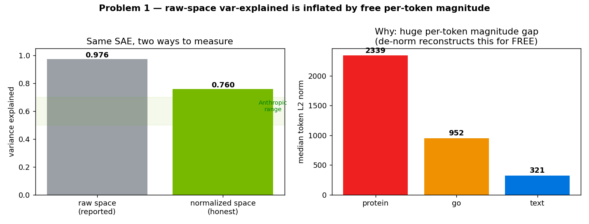
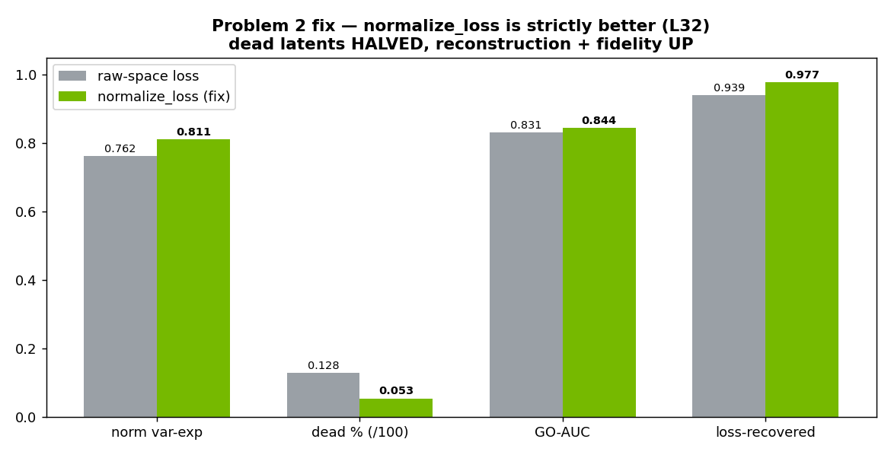
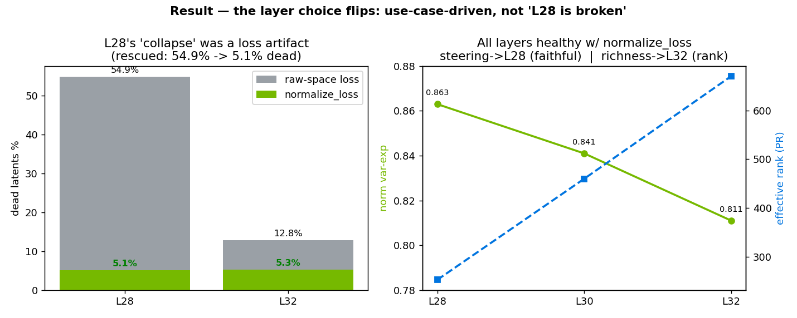

# What "97% variance-explained" really meant
### Debugging the BioReason-Pro SAE (first multimodal decoder-LLM SAE)

A TopK SAE on the Qwen3 residual stream (ESM3 protein + GO memory + reasoning text).
Initial runs reported **var-explained ≈ 0.97** — and that turned out to be hiding *two* bugs.

---

## The symptom 🚩

- SAE reported **0.97 variance-explained** with only ~12% dead latents.
- That's a **red flag**, not a win: a near-identity "copy machine," not an interpretable
  feature model. (Anthropic's production SAEs sit ~0.5–0.7.)
- Two independent things were wrong — a **metric** bug and a **loss** bug.

---

## Problem 1 — the metric measured the wrong space

`normalize_input` standardizes each token, then **de-normalizes** the reconstruction — reinserting
each token's exact magnitude **for free**. Token norms vary hugely (protein **2,339** vs text **321**),
so raw var-explained is dominated by that free magnitude. **Honest (normalized-space) = 0.76, not 0.97.**

---

## Ruled out — it was *not* sink tokens

A natural hypothesis: a few architectural "sink" tokens dominate. We tested it (SVD screen):

- Sinks **do exist** — a few stable outlier channels, ~0.1% of tokens at ~7× norm.
- **But removing every sink token changes var-explained by 0.0001.** `normalize_input` already
  neutralizes them.

➡️ Sinks are real but **not** the cause. (Good controls matter — the obvious culprit was innocent.)

---

## Problem 2 — the *loss* was raw-space too

- The reported metric was fixed, but the SAE was **still trained** on a raw-space FVU.
- A protein token (norm ~2,339) contributes **~50× more** to the MSE gradient than a text token (~321).
- So the SAE was *optimizing* high-magnitude-token reconstruction — magnitude that de-normalization
  already provides **for free** → wasted capacity → dead latents.
- `aggregate_loss` (prior fix) addressed per-token *ratio* starvation, but **not the space**.

---

## The fix — `normalize_loss`

Compute the FVU in **normalized space** → every token weighted equally; the objective now matches the
honest metric. Opt-in (unimodal recipes unaffected). **Strictly better: dead latents halved,
reconstruction + fidelity up.**

---

## The payoff — the layer choice flips

L28's "collapse" (54.9% dead) was a **raw-loss artifact** — under `normalize_loss` it drops to **5.1%**.
All layers healthy ⇒ choice is **use-case-driven**: **steering → L28** (earliest, most faithful);
**richest atlas → L32** (highest effective rank).

---

## Takeaways

1. **A suspiciously-high metric is a bug signal.** 0.97 var-explained = copy machine, not success.
2. **Two bugs, same root:** raw-space *measurement* (inflated) **and** raw-space *objective*
   (over-weights high-magnitude tokens). Fix both → honest 0.76→0.81 var-exp, dead 12.8%→5.3%.
3. **Controls earn trust:** the "obvious" sink-token culprit was ruled out by a one-line experiment.
4. **A wrong loss can fake a layer conclusion:** the raw-space loss made L28 look broken; the right
   loss rescued it and changed which layer we'd pick for steering.

*Multimodal note:* matters most when token norms vary a lot (protein vs text); unimodal models
(Evo2/ESM2) have ~uniform norms, so raw ≈ normalized and these are ~no-ops there.
