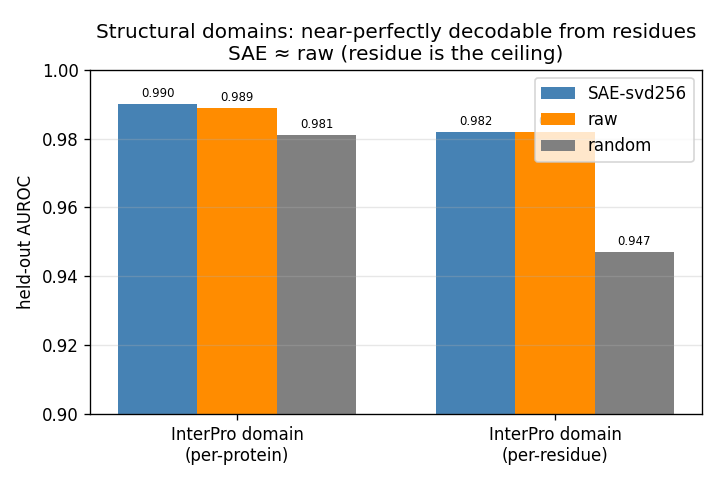
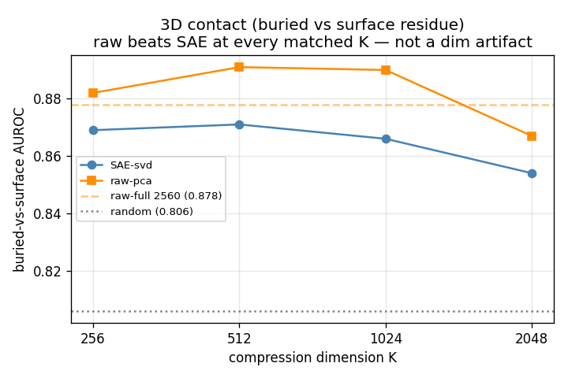
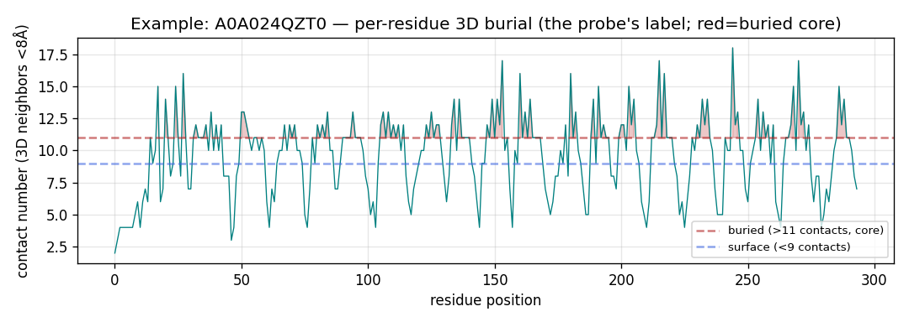

# Biological / Structural Probes — Results

_Do the SAE (and the underlying representation) encode protein structure, and does the SAE isolate
interpretable structural features? Self-contained results + experimental details._

## Experimental setup

| item | value |
|---|---|
| Model | BioReason-Pro SFT (ESM3 protein embeddings + Qwen3-4B reasoning LLM) |
| SAE | `sae-l30-exp16-balanced`, TopK, layer 30 residual, **input 2560 → 40,960 features (expansion 16×), top-k 128** |
| Data | 8,000 held-out-distribution proteins (`phase3_subset_8k/L30_subset8k`); AlphaFold v6 structures for 7,613 (95%) |
| Band probed | **protein / residue band** (ESM3 per-residue embeddings), not the reasoning band |
| Representations compared | **SAE-svd256** (SAE 40,960→256 via SVD) vs **raw** (2560-d, or PCA-256) vs **random-SAE** |
| Probe | logistic regression, held-out AUROC; per-feature analysis uses per-feature AUROC (rank-sum) |

**Two questions, two methods (this distinction matters):**
1. **Decodability** — "is structure in the representation?" → dense probe on SVD-256 / raw. (Compresses+mixes
   features; measures decodability + SAE-vs-raw, but *cannot name individual features*.)
2. **Which features** — "does the SAE isolate an interpretable structural feature?" → **per-feature AUROC**
   (each of the 40,960 features scored individually). *This is the interpretability question.*

## Labels probed

| probe | label (Y) | source | granularity | circular? |
|---|---|---|---|---|
| InterPro domain (presence) | protein has domain X? | `interpro_ids` | per-protein | non-circular |
| InterPro domain (boundary) | residue in domain X? | `interpro_location` spans | per-residue | non-circular |
| 3D contact / burial | residue buried (core) vs surface? | AlphaFold contact number (Cβ<8Å, top/bottom tercile) | per-residue | non-circular |

## Result 1 — Decodability (dense probe, SAE-svd256 vs raw vs random)

| probe | SAE-svd256 | raw | random | verdict |
|---|---|---|---|---|
| InterPro domain, per-protein (60 domains) | **0.990** | 0.989 | 0.981 | SAE ≈ raw (near-saturated) |
| InterPro domain, per-residue (boundaries) | **0.982** | 0.982 | 0.947 | SAE = raw |
| 3D contact (buried vs surface) | 0.873 | 0.886 (pca256) / 0.890 (full) | 0.811 | **raw > SAE** |

**Dimension-sweep control (is 256 too small for the 40,960-d SAE?):** SAE-svd vs raw-pca at matched K —

| K | SAE-svd | raw-pca |
|---|---|---|
| 256 | 0.869 | 0.882 |
| 512 | 0.871 | 0.891 |
| 1024 | 0.866 | 0.890 |
| 2048 | 0.854 | 0.867 |

**raw beats SAE at every matched dimension** → "SAE loses on 3D contact" is real, not a compression artifact.

*What "buried vs surface" means: one protein's per-residue 3D contact number (red = buried core).*

**Takeaway (decodability):** structure is **near-perfectly decodable from the ESM3 residues** (domains ~0.99),
and the **SAE never beats raw** — it re-expresses the residue representation (the encoder is the ceiling),
losing slightly on the harder 3D-contact probe. Expected: an SAE is a lossy re-expression; its value is
interpretability, not decodability.

## Result 2 — Which features? YES, the SAE isolates clean structural-residue features

Per-feature AUROC of each of the 40,960 SAE features against InterPro-domain-membership labels (residue band):
the best single feature per domain. **This corrects an earlier expectation** — the residue band is NOT feature-
barren for structure; it just isn't for GO *function*.

| InterPro domain | best feature | AUROC |
|---|---|---|
| Protein kinase domain (IPR000719) | **F16026** | **0.98** |
| Protein kinase-like (IPR011009) | F16026 | 0.97 |
| Armadillo (ARM) fold (IPR016024) | F679 | 0.95 |
| WD40 repeat (IPR015943) | F11009 | 0.92 |
| Homeodomain-like (IPR009057) | F5540 | 0.90 |
| Ig-like (IPR036179 / IPR007110 / IPR013783) | F17703 / F25050 / F1386 | 0.87 |
| Zinc-finger (IPR013083) | F8306 | 0.80 |
| P-loop NTPase (IPR027417) | F7079 | 0.75 |

**So the SAE HAS individual, nameable structural-residue features** — e.g. F16026 fires on protein-kinase-domain
residues at 0.98 AUROC; different features cleanly pick out different folds (kinase, ARM, WD40, Ig-like, Zn-
finger). 8 of 10 abundant domains have a clean (>0.80) single feature.

**Reconciliation with "SAE ≈ raw":** the SAE doesn't *decode* domains better than raw (both ~0.99), but it
*isolates* each fold into a **single nameable feature** — an interpretable handle raw's entangled dimensions
don't give. So on the residue band the SAE adds **interpretability** (nameable structural features) even though
it adds no **decodability**. (Buried-vs-surface per-feature number pending — the first pass had an AUROC bug,
re-running.)

## Bottom line
- **Structure lives in the ESM3 residues at ceiling** (domains ~0.99, 3D burial ~0.89); the **SAE re-expresses
  it, never beats raw.**
- Contrast: **function (GO) is weak in residues (~0.83) but ~0.95 in the reasoning band** → structure in
  residues, function in reasoning.
- The **SAE's interpretability value is in the reasoning band**, not the residues (see the reasoning-feature +
  steering + synthesis results in `RESULTS.md`).

_Scripts: `interpro_probe.py`, `residue_domain_probe.py`, `contact_residue_probe.py` (+ `download_alphafold.py`),
`per_feature_structural.py`, `make_probe_charts.py`._
