# Sparse Autoencoders on a Multimodal Protein-Reasoning Model

*Savitha S. — July 2026. Companion mini-paper to the BioReason-Pro SAE recipe.*

## Abstract

BioReason-Pro is a multimodal model that fuses ESM3 protein embeddings, a GO-graph encoder, and a Qwen3-4B reasoning LLM to predict protein function through a written reasoning trace. We train sparse autoencoders (SAEs) on its residual stream and pull the fused representation apart into interpretable features. We find (i) **reasoning-band features that decode genuine biological concepts** above a strict leakage floor — most cleanly a distributed *antimicrobial-defense circuit* with pathogen-specific detectors on a shared innate-immune core; (ii) **protein-domain features that localize**, measured with a domain-F1 metric that separates localized detectors (a kinesin-motor feature, domain-F1 = 0.98) from high-AUROC features that fire *outside* their domain; and (iii) a **cross-modal structure** linking protein features to reasoning features that is correlational and prompt-mediated, not a causal fusion. This required solving a multimodal-training problem — a single dictionary is monopolized by the majority (text) modality, so **loss balancing is mandatory** (it yields 20–50× more protein-selective features). We ship an auto-interp pipeline, a grounded synthesis-quality scorer, and an interactive feature atlas. A side observation: the SAE does not out-decode the raw residual stream on dense probes — the ESM3 encoder is the ceiling — which is why the SAE's value here is *interpretable structure*, not raw decodability.

---

## 1. Introduction

Most SAE interpretability work targets a single modality — a protein language model, a codon model, a genome model. BioReason-Pro is different: it *reasons* about a protein in text. ESM3 residue embeddings and a GO-graph encoder are projected into the token stream of a Qwen3-4B LLM, which writes a free-text reasoning trace ("…the N-terminal P-loop NTPase fold positions duplex DNA…") and predicts GO function. A single residual stream therefore carries **three modalities at once** — protein-residue tokens, reasoning-text tokens, and `<go>` graph slots — and the interpretability question becomes: *what does each modality's features encode, and do they connect?*

Our contributions:

1. **Reasoning-band concept probes** with a leakage-aware evaluation, surfacing a distributed antimicrobial-defense circuit (and showing which "concepts" are real vs leakage).
2. **Protein-domain features + a localization metric (domain-F1)** that separates genuine domain detectors from AUROC artifacts.
3. **A cross-modal exploration** aligning protein features with reasoning features, and a causal test showing the link is prompt-mediated, not fused.
4. **A multimodal-SAE training recipe** whose central lesson is loss balancing — without it, the minority (protein) modality gets almost no features.
5. **An auto-interp pipeline, a synthesis-quality scorer, and an interactive feature atlas.**

---

## 2. Background & methods

### 2.1 How BioReason-Pro works

BioReason-Pro predicts protein function not as a classifier head but as a **reasoning task**. For a protein it (a) encodes the sequence with **ESM3** into per-residue embeddings, (b) encodes candidate GO structure with a **GO-graph encoder** into a fixed set of `<go>` memory slots, (c) projects both into the token embedding space of a **Qwen3-4B** LLM, and (d) has the LLM generate a natural-language reasoning trace that dissects the protein's domains and mechanisms before emitting GO terms. The consequence for us: the layer-30 residual stream we read is a **fused, multimodal** representation — one token is a protein residue, the next is a `<go>` slot, the next is a reasoning word — and any feature we learn lives in one (or across) those bands. We tag every activation row with its band (`protein` / `text` / `go`) in a row-aligned sidecar so downstream analyses can select a modality.

### 2.2 Training a multimodal SAE: loss balancing

**A multimodal SAE cannot be trained naïvely.** In the natural token mix, protein residues are ~15% of the stream and reasoning text is ~80% (see the dataset table in §2.3). Left alone, text tokens monopolize the dictionary: they activate essentially the whole live dictionary (~15,800 features at layer 16) while protein collapses into ~230. The SAE "works" — good reconstruction, low dead-latent % — but it has almost no protein vocabulary.

The fix is **modality balancing at load time** (`--balance-modality`): we drop the `<go>` slots (an ablation shows they are model-unused — a fixed ontology reduction, not per-protein terms), and **downsample text to ~50/50 with protein** (text-keep ≈ 0.19). We measure the effect as *protein-selective* features (fires on >1% of protein tokens, <0.1% of text):

| Layer | protein-selective (unbalanced → balanced) |
|------:|:-----------------------------------------:|
| L16 | 12 → **650** |
| L24 | 34 → **928** (peak) |
| L30 | 12 → **663** |
| L32 |  9 → **655** |

A **20–50× increase at every layer** — balancing carves out capacity the natural mix never gave protein (richest around L22–L24), without starving text.

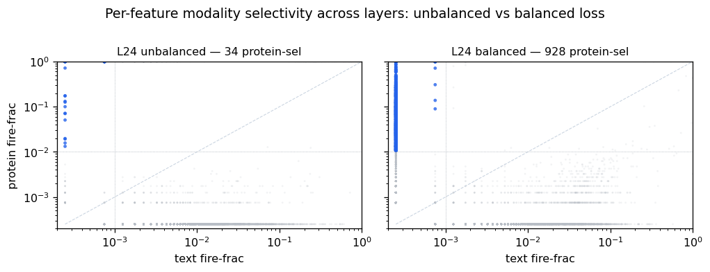
> **Modality balancing at layer 24 (the peak).** Each dot is a feature: x = fraction of text tokens it fires on, y = fraction of protein tokens; blue = protein-selective. Unbalanced (left) gives protein 34 dedicated features; balanced (right) gives 928. All nine layers in Appendix A.

Two more multimodal-training lessons:

- **Batch-aggregated loss, not per-token** (`--aggregate-loss` + `--normalize-loss`). In a multimodal stream tokens sit at very different distances from the shared center and are reconstructed to very different degrees; a per-token loss ratio starves the minority modality's features (FVU term) and mis-aims dead-latent revival toward already-well-reconstructed tokens (AuxK term). Batch aggregation fixes both. (Single-modality recipes like evo2 can skip it; multimodal cannot.)
- **How much to balance?** A sweep puts the sweet spot at **~50–60% protein** — past ~40% dead latents climb (≈46% dead at 70%), because the low-diversity ESM3 protein embeddings can't fill a protein-dominated dictionary.

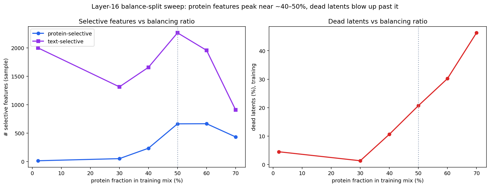
> **Balance-split sweep (L16).** Protein-selective features peak at ~50–60% protein; dead latents rise past 40%. 50/50 is the reported config.

### 2.3 SAE architecture and evaluation discipline

For each `x ∈ ℝ^2560` we train a TopK SAE to a sparse code `z ∈ ℝ^40960` (expansion 16, **k = 128**) with reconstruction + auxiliary-k revival loss. Our reported model is `sae-l30-exp16-balanced`.

**Training data (layer-30 activation store).** The SAE trains on the full CAFA5 training set — **421.3M** activation vectors (~116k proteins, 2,108 shards), split across the three modality bands:

| band | tokens | share |
|---|---:|---:|
| protein (ESM3 residues) | 63.0M | 14.9% |
| reasoning text | 335.0M | 79.5% |
| `<go>` graph slots | 23.4M | 5.6% |
| **total** | **421.3M** | |

Balancing keeps all protein tokens and downsamples text to ~50/50 (text-keep ≈ 0.19), with `<go>` dropped — so the SAE **consumes ~373M tokens over 3 epochs** (~124M balanced tokens per epoch, from wandb `consumed_samples`).

Two disciplines govern every number below:

- **The leak floor.** The reasoning text often *states* the function, so a random-initialized SAE already "decodes" it. We train a probe on a random SAE as a **leak floor** and trust only the margin `sae_sparse − random`.
- **Scoring vs labeling.** We separate **scoring** (label-grounded per-feature AUROC — trustworthy) from **labeling** (an LLM auto-interp read of a feature's top windows — a hypothesis). Our auto-interp pipeline takes a feature's top-firing windows in a chosen band, **strips cited `GO:`/`IPR` accessions** (so the LLM interprets reasoning, not label echo), marks the **full active phrase** (span-aware), and asks for one concept. We treat the label as a hint and always confirm by AUROC + reading the windows — because the pipeline both *misses* (F23726, fungal AUROC 0.975, mislabeled "amino acid transport") and *oversells* (F15775 "autophagy", fungal AUROC only 0.572).

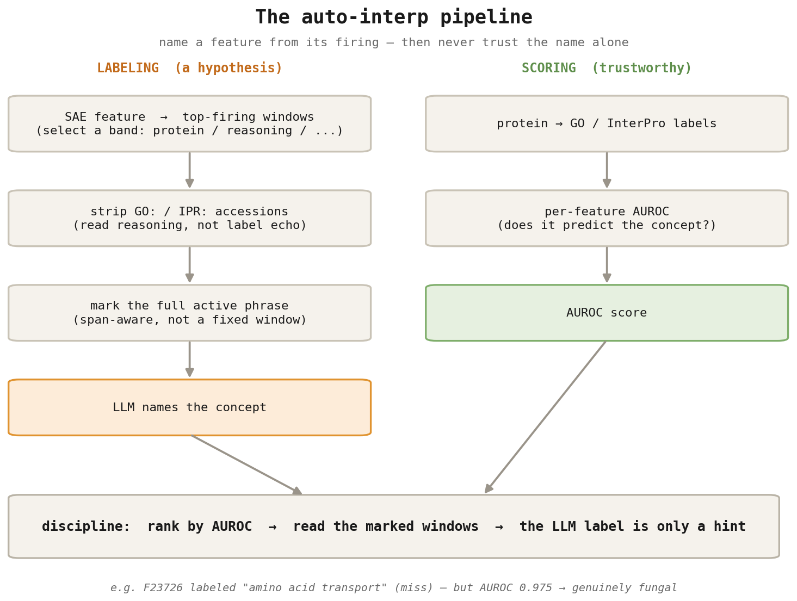
> **The auto-interp pipeline.** Two tracks: *labeling* (a hypothesis — read the firing, strip accessions, mark the full phrase, let an LLM name it) and *scoring* (trustworthy — per-feature AUROC against GO/InterPro). The discipline: rank by AUROC, read the marked windows, treat the LLM label as only a hint.

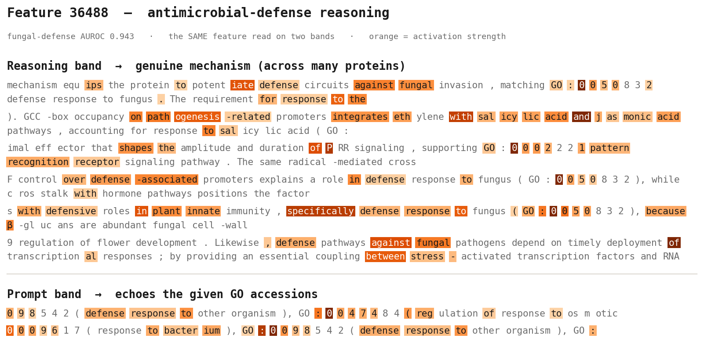
> **Reading a feature per band.** Feature 36488 (antimicrobial defense) on its **reasoning** band writes genuine mechanism ("defense circuits against fungal invasion… pathogenesis-related promoters integrate ethylene with salicylic acid… pattern-recognition receptor signaling"); the *same* feature on the **prompt** band merely echoes the given `GO:` accessions ("defense response to other organism…"). We interpret the reasoning band only, accessions stripped. Orange = activation strength.

---

## 3. Results

### 3.1 Reasoning-band probes: a distributed antimicrobial-defense circuit

The cleanest reasoning result is antimicrobial defense. Probing 12 designed GO concepts against the leak floor, **only 4 clear a margin ≥ 0.05** — defense→fungus (+0.111), defense→bacterium (+0.108), structural-molecule (+0.063), plasma-membrane (+0.055); the other 8 sit at the floor (the text just names them). So most "decodable" concepts are leakage — and the defense concepts are the signal.

Defense is a *distributed circuit*, not one feature. Ranking the defense→fungus features by **label-grounded AUROC**:

| tier (per-feature fungal AUROC) | features | meaning |
|---|---|---|
| **genuine fungal** ≥ 0.94 | F2808 (0.99), F35336 (0.99), F32785 (0.99), F23726 (0.98), F36488 (0.94) | individually predict fungal defense |
| weak / correlate 0.6–0.72 | F7665 cell-wall, F5047 motility, F22156 | marginal |
| co-occurring ~0.5–0.59 | F2082 chromatin, F15775 autophagy, F28215, F29332 | NOT fungal — the probe picked them as co-predictors |

The genuine set has a biological shape: **pathogen-specific detectors** (F23726 "filamentous fungi"; F22077 "bacterial LPS") on a **shared innate-immune core** (F35336/F2808/F32785 = fungus ∩ bacterium). And it is *genuine reasoning*, not echo: on the reasoning band F36488 fires on genuine mechanism across many proteins — "redox gating of pattern-recognition receptors… potentiate defense circuits against fungal invasion", "GCC-box occupancy on pathogenesis-related promoters integrates ethylene with salicylic acid and jasmonic acid pathways", "β-1,3-glucans… defense response to fungus", "a secretory peroxidase in the cell wall/apoplast functions as a proximal effector"; flip the same feature to the prompt band and it's just echoed `GO:` accessions.

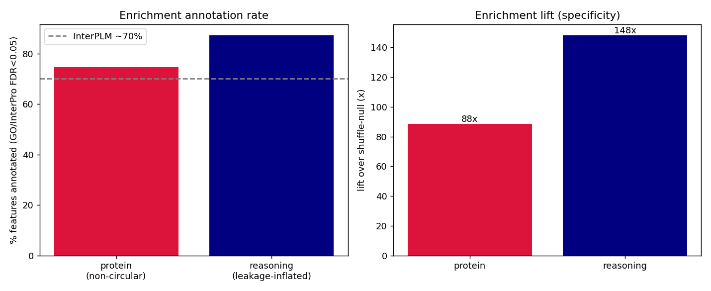
> **Per-feature GO+InterPro enrichment.** Best over-represented term per feature with hypergeometric FDR and rank-sum AUROC — the label-grounded scoring behind the tiers above.

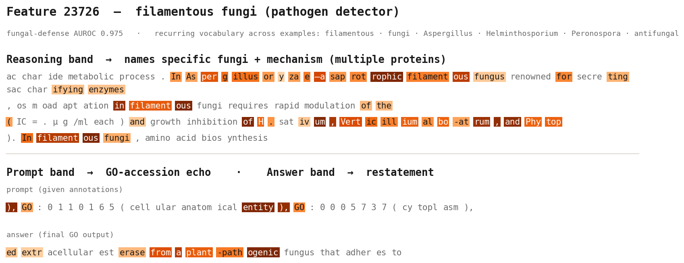
> **A pathogen-detector feature (F23726), read across bands.** On the reasoning band it names specific fungi and mechanism across multiple proteins — the recurring vocabulary (*filamentous · fungi · Aspergillus · Helminthosporium · Peronospora · antifungal*) lights up in every example. The prompt band echoes GO accessions; the answer band restates. Fungal-defense AUROC 0.975.

Honest caveat: a sparse probe selects *predictive* features, not features that *mean* the concept (≈⅓ are co-occurring correlates), and the **protein band has no clean defense feature** — defense is a reasoning-band phenomenon.

### 3.2 Protein-domain features: Fisher enrichment + a localization metric

For protein-band features we compute the most over-represented **GO or InterPro** term among the proteins where each feature fires (hypergeometric + per-feature AUROC), surfacing clean structural detectors — a GPCR-rhodopsin feature (IPR000276, FDR 3e-84), a kinesin-motor feature, and more.

But **AUROC is not localization** — a feature can score 0.98 for a domain and fire *outside* it. So we add **domain-F1** = (per-position precision: of firing residues, fraction inside the domain) × (per-region recall: of domain regions, fraction with ≥1 firing residue):

| feature | concept | AUROC | **domain-F1** | verdict |
|---|---|---|---|---|
| **F18393** | kinesin motor | 0.98 | **0.98** | 📍 localized |
| F7369 | GPCR (IPR000276) | high | 0.51 | ⚠️ half in-domain |
| **F4647** | (AUROC oversell) | **0.98** | **0.00** | ❌ fires *outside* the domain |

Across all AUROC-passing structural features, **only ~17% (59 of 872) localize.** For structural interpretability, trust the localization metric, not the ranking metric.

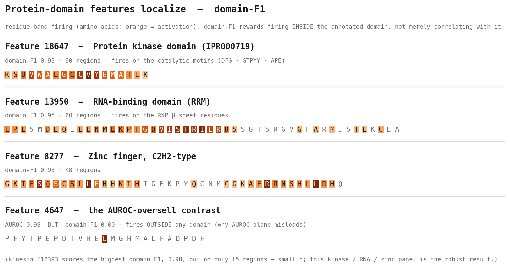
> **Protein-domain features localize.** Residue-band firing for a nucleic-acid-binding panel — RNA-binding RRM (domain-F1 0.95, 60 regions), zinc finger C2H2 (0.93, 48), helix-loop-helix DNA-binding (0.93, 27) — each fires on the domain's structural residues. F4647 (AUROC 0.98, domain-F1 0.00) barely fires and outside any domain — the "AUROC oversell." Kinesin scores highest (0.98) but on only 15 regions, so this well-supported panel is the robust result.

### 3.3 Cross-modal exploration: aligning protein and reasoning features

Do a protein's domain features connect to what the model *says* about it? We aligned the two bands two ways:

- **Pairing (unsupervised):** correlate one protein feature's per-protein activation vector against every reasoning feature's → its single best partner. Kinesin F18393 ↔ F15673 (r = 0.62); GPCR F7369 ↔ F3184 (r = 0.89).
- **Combined probe (supervised):** an L1-logistic on `[protein ; reasoning]` features for a concept → a distributed cross-band set.

The two methods **disagree** — the pairing's kinesin partners are *not* recruited by the kinesin probe — because one measures co-firing and the other prediction. And a **2×2 causal test settles the interpretation**: clamping a reasoning feature writes its concept into the trace, but the paired protein feature is causally inert. So the cross-modal link is **correlational and prompt-mediated — the model "talks about motors" when the motor detector fires — not a causal protein→reasoning feature flow.** The mediation is concrete: the model's intermediate `go_pred` already carries **68%** of the ground-truth GO terms and the final answer echoes it at **38%**, so the reasoning is anchored on the given annotations — protein and reasoning features co-vary *through the shared prompt*, not through each other. (Consistently, protein and text separate in the raw residual stream at every layer, so there's no fused sub-space for the SAE to find.)

By the stricter **SAE-V** definition of a cross-modal feature (*arXiv 2502.17514*) — a *single* latent genuinely active across both modalities — we find **no examples**: the per-feature cross-modal metric is ≈ 0 for every feature. The alignment we report is co-activation between *separate* protein and reasoning features, not one fused cross-modal feature.

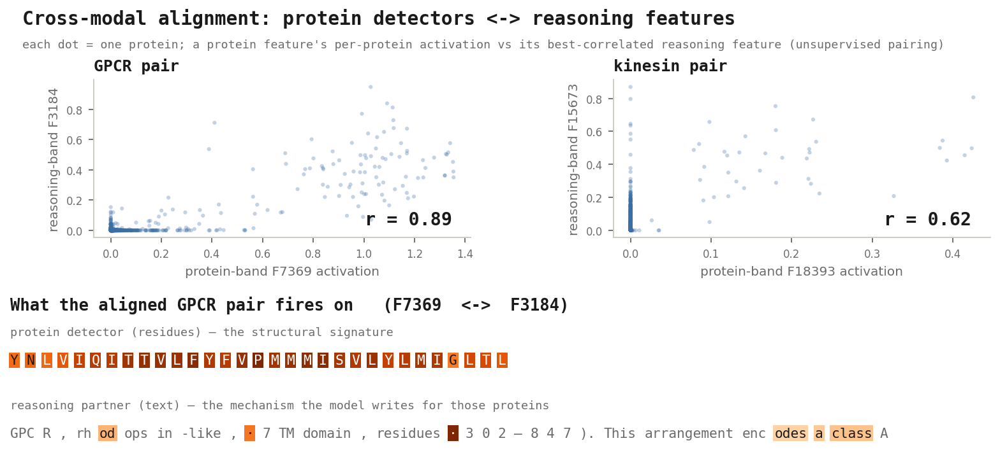
> **Cross-modal alignment.** *Top:* per-protein co-activation for two aligned pairs (GPCR r = 0.89, kinesin r = 0.62) — each dot is a protein, a bio feature's activation vs its best-correlated reasoning feature. *Bottom:* what the GPCR pair fires on — the protein detector (F7369) fires on the transmembrane residues, while its reasoning partner (F3184) writes the GPCR mechanism ("rhodopsin-like, 7TM domain… class A"). The alignment is correlational and **prompt-mediated** — the 2×2 causal test shows the reasoning feature writes the concept while the paired protein feature is inert — not a fused feature-to-feature flow.

### 3.4 Synthesis features: reading genuine mechanism

Beyond named concepts, a grounded scorer (`synth_span_scorer.py`, no LLM) ranks reasoning features by good-synthesis quality — frequency-filtered (drop broadband "reasoning-mode" features), firing on long contiguous phrases, scored for mechanism verbs + inference language + beyond-prompt named entities − echo. It *discovers* mechanistic features automatically: **F12706** (DNA-TF motif recognition), **F15088** (mRNA translation control — poly(A)/eIF4E/CCR4-NOT), **F30993** (transporter alternating-access), **F5221** (RAS signaling — SOS1/RAF).

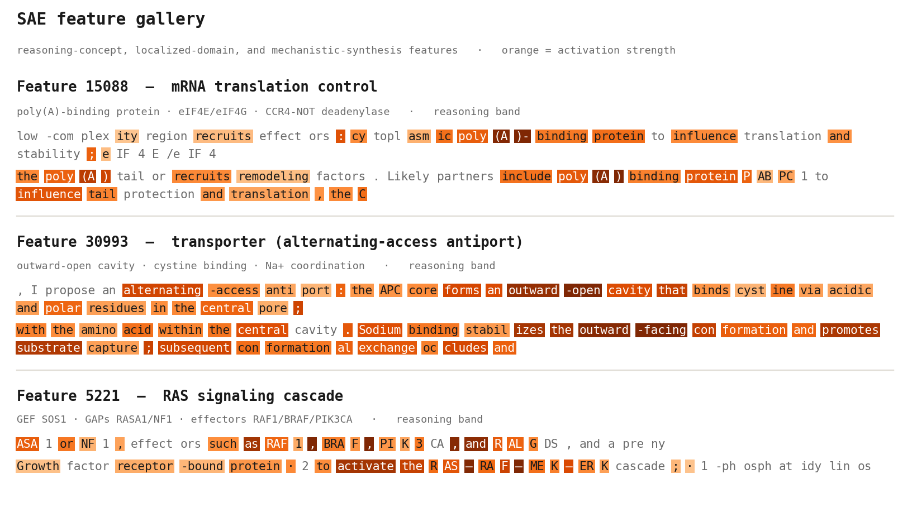
> **Mechanistic-synthesis features — multi-word reasoning beyond GO terms.** Top-activating reasoning windows for three synthesis-scorer features: mRNA translation control (poly(A)-binding protein · eIF4E/eIF4G · CCR4-NOT deadenylase), transporter alternating-access (outward-open cavity · cystine binding · Na⁺ coordination), and RAS signaling (GEF SOS1 · GAPs RASA1/NF1 · RAF-MEK-ERK cascade). These fire on extended mechanistic *phrases*, not single GO terms. Orange = activation strength.

### 3.5 Steering: reasoning features are causal, protein features are read-only

Are these features causal, or just correlational read-outs? We clamp a feature-cluster's activation during generation on held-out proteins and read the trace. The result is a **double dissociation**:

- **Reasoning-band features are causally steerable.** Clamping a concept's reasoning features injects that concept into the trace — feature-specific (a random matched-norm direction injects nothing — the null) and concept-appropriate. Synapse features reach a **0.77 coherent-injection rate** at clamp strength α≈180 (n = 40 zero-baseline proteins); mitochondrion 0.60. Injection turns on sharply around α≈180 (weaker clamps do nothing; stronger risks degeneration).
- **Protein-structure features are read-only.** Clamping them perturbs the text but **never writes the concept** — a residue/domain feature cannot make the model reason "kinase" (corroborated by logit-lens: protein features project to garbage in text-output space). Detecting a concept and being a lever for it are different properties.

Steering also shows *what kind* of causal it is. An independent LLM judge, rating whether the concept is *reasoned about* vs merely sprinkled in, scores synapse at **~31% genuine redirection** against a **~73% coherent lexical-injection** rate. So clamping mostly **grafts concept vocabulary onto otherwise-intact reasoning** ("binds post-synaptic density marks on histone H3"), redirecting the reasoning about a third of the time. Notably, the cleanest *detector* (an ER feature, AUROC 0.99 / coherence 1.0) is a poor *handle* — no injection at all. Steering confirms the reasoning features are causal; it also shows the causality is **concept-injection, not goal-redirection** — consistent with §3.3's prompt-mediated cross-modal picture.

---

## 4. A note on decodability (why the SAE's value is structure, not raw signal)

A natural question is whether the SAE *out-decodes* the raw residual stream, as it does in codon models. Here, mostly it does not. On dense per-protein probes, SAE, raw, and even a random SAE saturate together (InterPro domains: 0.990 / 0.989 / 0.981), and the sparse SAE beats raw only for the few reasoning concepts that clear the leak floor. The reason is the **encoder, not the SAE**: ESM3 protein token embeddings are nearly collinear (self-cosine ≈ 0.99), so per-token protein signal is real but swamped — even balanced, protein code spread stays ≈ 0.006 vs text ≈ 0.024. This is why our Matryoshka + modality-weighting variants never beat flat TopK (they starved protein further), and why the next step is **encoder alignment** (Prot2Text-style), not a bigger dictionary. The SAE's contribution here is interpretable, localizable, steerable *structure* — not decodability.

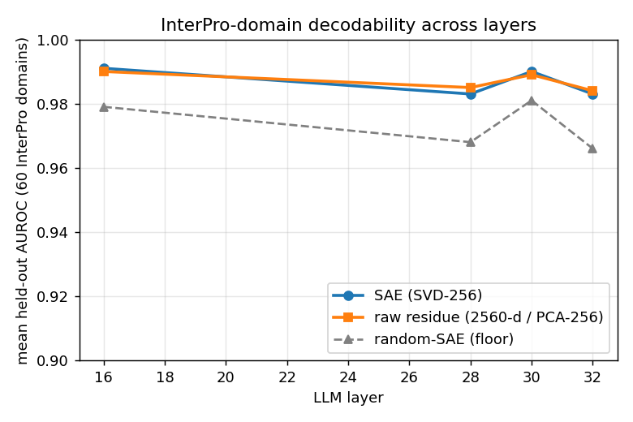
> **Decodability across layers.** SAE, raw, and random-SAE probes track each other — the SAE doesn't open a gap over raw, unlike the codon-model result.

---

## 5. An interactive multimodal feature atlas

Interpretability is exploratory, so we ship a browser-based atlas: per-band firing windows (protein / reasoning / prompt / answer), activation-frequency and metric histograms, sortable feature cards, a **domain-F1 localization badge**, GO+IPR enrichment, cross-modal pair links, and a **🔍 live auto-interp** button (span-aware, accession-stripped). It closes the loop that produced every result above — from the global UMAP of decoder vectors, to a filtered feature subset, to the residue- or token-level evidence for a single feature.

---

## 6. Conclusion

Applying SAEs to a multimodal protein-reasoning model, we recover **interpretable structure across all three modalities**: reasoning-band concepts that pass a strict leakage test (a distributed antimicrobial-defense circuit), protein-domain features that *localize* (domain-F1), and a cross-modal alignment between them that we show is prompt-mediated rather than causal. The enabling method is loss balancing — a single dictionary must be forced to give the minority modality room. The limitation is that the SAE does not out-decode the raw stream, because the protein encoder is collapsed; the value is not decodability but a set of *readable, localizable, steerable* features and a clear picture of where the limit is. All training artifacts, the auto-interp pipeline, the synthesis scorer, and the feature atlas are open-sourced.

---

*Sources: `RESULTS_WRITEUP.md`, `MICROBIAL_DEFENSE_RESULTS.md`, `DASHBOARD_REVIEW_CHECKLIST.md`, `PHASE3-LAYER-BALANCING.md`, `CROSSMODAL_PAIRS.md`.*

---

## Appendix A — modality selectivity across all layers

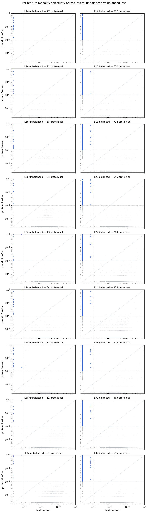
> **Per-feature modality selectivity, L14–L32, unbalanced (left) vs balanced (right).** The 20–50× protein-feature gain holds at every layer, peaking at L24 (34 → 928).
