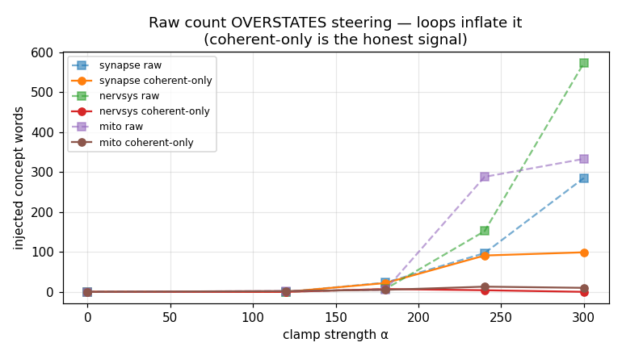
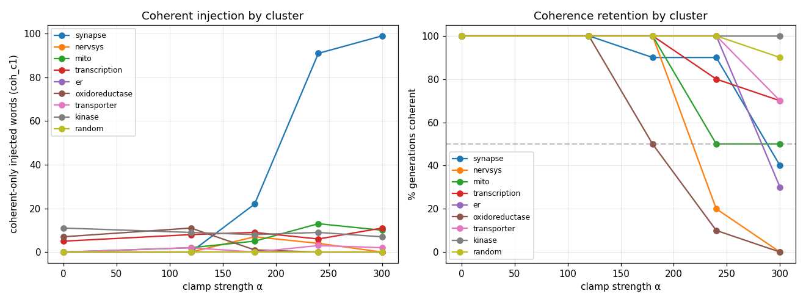
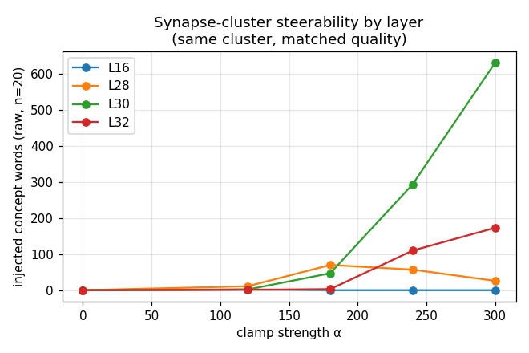

# Phase 3 — Interpretability of Reasoning in BioReason-Pro: Steering & Synthesis

_Auto-generated by `scripts/make_results_charts.py` from the run logs. Re-run it to refresh as jobs complete._

## What was tested

On the L30 SAE (`sae-l30-exp16-balanced`, exp16, 40,960 features), we ask three questions about reasoning-band features: are they **causal** (steering), is the effect **coherent**, and are they **synthesis** vs prompt-**echo**.

| question | script | what it does |
|---|---|---|
| Causal steering + coherence | `scripts/steer_generation.py` | clamp a feature cluster into the layer-L residual during generation; `--features` group, `--random-dirs` control; measures concept words + distinct3/nonascii/gibber coherence + `coh_c1` (concept words in coherent gens only) |
| Echo vs synthesis | `scripts/synthesis_probe.py` | per feature, novelty = frac top-firing tokens NOT in the prompt (low=echo, high=synthesis); connective = frac inference markers |
| Cluster mining | `analysis/validated_features_l30_reasoning.csv` | high-quality steerable clusters |

## 1. Steering is feature-specific & causal, but coherence is graded

Raw concept-word counts **overstate** steering because at high α the model falls into repetition loops ("nervous system nervous system…") that inflate the count. `coh_c1` (words counted only in generations passing distinct3≥0.55, nonascii≤0.02, gibber≤0.20) is the honest signal. The **random matched-norm control injects 0** everywhere → the effect is direction-specific.

### Per-cluster coherence (n=10, L30)

| cluster | best α | %coherent@best | coh_c1@best | verdict |
|---|---|---|---|---|
| synapse | 240 | 90% | 91 | **coherent + causal ✓** |
| nervsys | 180 | 100% | 7 | causal but DEGENERATES into loops at high α |
| mito | 180 | 100% | 5 | causal but DEGENERATES into loops at high α |
| transcription | 300 | 70% | 11 | weak |
| er | 0 | 100% | 0 | weak / not steerable |
| oxidoreductase | 120 | 100% | 11 | baseline-confounded (already on at α=0; no dose-response) |
| transporter | 240 | 100% | 3 | weak / not steerable |
| kinase | 0 | 100% | 11 | baseline-confounded (already on at α=0; no dose-response) |
| random | 0 | 100% | 0 | null control ✓ |

## 2. Steerability depends on layer (matched synapse cluster, n=20)

Same high-quality synapse cluster steered at each layer. **L16 = null** (concepts not yet steerable directions); **L28** injects but over-breaks; **L30** strongest/most coherent; **L32** moderate. De-confounds the earlier 'L28=salad' (that was a weak repro cluster).

## 3. Echo vs synthesis reasoning features

Over 202 L30 reasoning features: novelty mean=0.56, echo (novelty<0.3)=20%, synthesis (>0.6)=48%. Low-novelty features restate prompt GO terms (circular); high-novelty fire on synthesized text.

## 4. Sequence-level (non-circular) protein probes

- **InterPro domain (per-protein, 60 domains):** SAE-svd **0.99** ≈ raw 0.989 ≈ random 0.981. Structural domains are near-perfectly, non-circularly decodable from ESM3 residues; SAE re-expresses, doesn't beat raw = the **residue-band ceiling**. Contrast GO function (~0.83 from residues) → **structure lives in residues, function emerges in reasoning.**

- **InterPro domain (residue-resolution, is-this-residue-in-domain):** SAE-svd **0.982** | raw 0.982 | random 0.947. Harder than per-protein presence — tests whether the rep knows domain *boundaries* along the chain.

- **Synthesis vs echo (reasoning band, 202 feats):** echo hypothesis for steerability NOT supported — most reasoning features are synthesis-leaning (48% novelty>0.6, only 20% echo). F39407 (hormone) novelty 0.63 = genuine synthesis, non-circular.

## Honest limitations

- **Steering n=10–20** (generation is expensive) — winning conditions need firming to n≥50.

- Coherent-steering window is **narrow** (breaks by α≈300) and **concept-dependent**.

- Coherence metric is lexical (distinct3/nonascii/gibber), not an LLM-judge — a stronger rating would be an independent judge model.

## Raw data / logs

- Coherence tables: `steer_logs/coh_*.log` · layer sweep: `steer_logs/firm_l*.log`

- Synthesis: `synthesis_l30_allvalidated.json` · clusters: `analysis/validated_features_l30_reasoning.csv`
