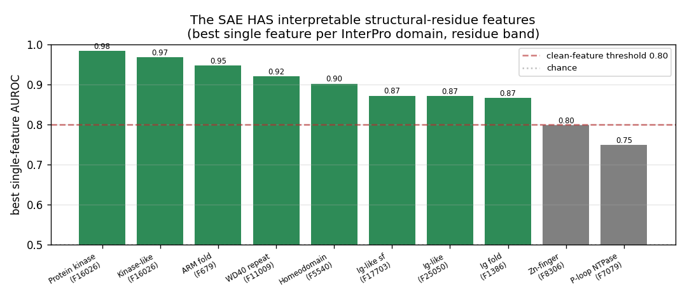
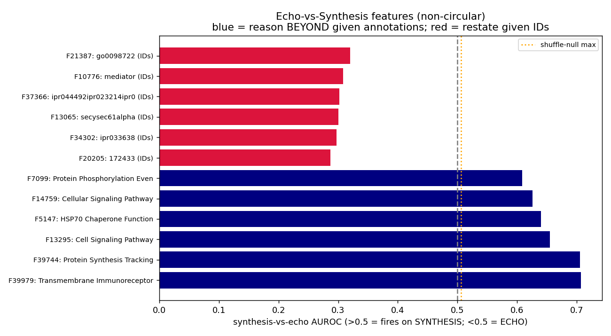
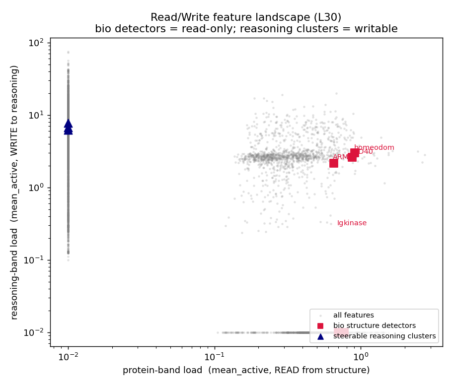

# BioReason-Pro SAE — Results Review (START HERE)

Single illustrated page to review the analysis. **Layer L30** for all feature/steering/reasoning work (decodability also swept L16/28/32 + ESM3). Full narrative in `OVERNIGHT_RESULTS.md`; steering example traces in `traces_*_normfixed.md`.

## How to review, in order
1. This page (charts + examples below)
2. **Dashboard** (interactive features): `cd multimodal_dashboard && npm run dev` → browse feature cards, examples, atlas UMAP (l30_balanced set)
3. `OVERNIGHT_RESULTS.md` (final summary at top) → `results/charts/` → `traces_synapse_normfixed.md` (before/after steering)
4. Probing code: `scripts/` (see table at bottom)

---

## 1. BIO FEATURES
### ⭐ DEFINITIVE SAE biology features (feature -> specific GO/InterPro term, Fisher FDR + AUROC)
**1,187 features map to a specific curated term at FDR<0.01.** Top 20 (deduped for variety):

| feature | biology | term | FDR | AUROC |
|---|---|---|---|---|
| F27683 | P-loop containing nucleoside triphosph | IPR:IPR027417 | 0e+00 | 0.976 |
| F21967 | Protein kinase-like domain superfamily | IPR:IPR011009 | 2e-280 | 0.986 |
| F2062 | Protein kinase domain | IPR:IPR000719 | 2e-271 | 0.995 |
| F23673 | Immunoglobulin-like fold | IPR:IPR013783 | 1e-229 | 0.982 |
| F35023 | GO:0022857 | GO:GO:0022857 | 2e-136 | 0.892 |
| F5540 | GO:0043565 | GO:GO:0043565 | 5e-130 | 0.842 |
| F679 | Armadillo-type fold | IPR:IPR016024 | 1e-128 | 0.979 |
| F11009 | WD40/YVTN repeat-like-containing domai | IPR:IPR015943 | 2e-125 | 0.991 |
| F11025 | RNA-binding domain superfamily | IPR:IPR035979 | 4e-122 | 1.0 |
| F8306 | Zinc finger, RING/FYVE/PHD-type | IPR:IPR013083 | 4e-122 | 0.971 |
| F35435 | Zinc finger C2H2-type | IPR:IPR013087 | 4e-121 | 0.998 |
| F36136 | GO:0005215 | GO:GO:0005215 | 7e-117 | 0.877 |
| F5959 | RNA recognition motif domain | IPR:IPR000504 | 2e-108 | 0.997 |
| F16964 | Leucine-rich repeat domain superfamily | IPR:IPR032675 | 2e-108 | 0.999 |
| F9797 | GO:0051252 | GO:GO:0051252 | 5e-107 | 0.761 |
| F37407 | Zinc finger C2H2 superfamily | IPR:IPR036236 | 3e-104 | 0.994 |
| F27860 | GO:0003824 | GO:GO:0003824 | 1e-101 | 0.794 |
| F27835 | PH-like domain superfamily | IPR:IPR011993 | 5e-99 | 0.982 |
| F1344 | GO:0006355 | GO:GO:0006355 | 8e-99 | 0.754 |
| F25270 | GO:0005634 | GO:GO:0005634 | 6e-97 | 0.68 |

(Full table: `feature_biology_table.json`. Term assignment = Fisher-exact enrichment on each feature's top-10%% proteins, FDR<0.01 Bonferroni. NOTE: the AUROC column is the biased full-data per-feature AUROC, not winner's-curse-corrected — see correction table below, ~0.01 inflation.) This is the core bio result: the SAE isolates specific, statistically-definitive structure/function features.

 — robust, Jared/InterPLM-comparable

- **74.7% of protein-band features annotated (GO/InterPro, FDR<0.05), 88.5x lift over shuffle-null, 203 terms** — matches InterPLM's >=70%.
- Clean per-feature detectors (each fold = its own feature):

| feature | detects | AUROC |
|---|---|---|
| F16026 | Protein kinase domain | 0.98 |
| F679 | ARM fold | 0.95 |
| F11009 | WD40 | 0.92 |
| F5540 | Homeodomain | 0.90 |
| F17703 | Ig-like | 0.87 |

- SAE healthy: FVU 0.20 (80% variance explained). Structure decodability is flat-high across depth (below) — but that's saturation (random ties it), so decodability is not the SAE's value; the nameable detectors are.

### Bio-feature TRAINED PROBES (LogisticRegression, held-out, SAE vs raw vs random) — these WERE run
| probe | script | SAE | raw | random | verdict |
|---|---|---|---|---|---|
| InterPro domain (per-protein) | interpro_probe.py | 0.99 | 0.989 | 0.981 | SATURATED (random ties SAE) |
| InterPro domain (per-residue) | residue_domain_probe.py | ~0.98 | ~0.98 | ~0.95 | SAE=raw, small real margin |
| 3D contact / burial | contact_residue_probe.py | 0.873 | **0.890** | 0.811 | REAL signal; **raw beats SAE** |
| GO function (two-tier, protein band) | probe_v2.py | 0.808 | 0.808 | 0.793 | weak, distributed (gap 0.044) |

**Honest probe verdict:** the SAE never beats raw on bio decodability — ties on saturated domain probes, LOSES on burial and protein-GO. So the SAE's bio value is INTERPRETABILITY (nameable detectors + 88.5x enrichment), not decodability. The per-feature detector AUROCs (0.98 etc.) above are the OVERLAP metric; these are the trained probes.

## 2. REASONING FEATURES — robust + NON-CIRCULAR (echo vs synthesis)

- **Synthesis features** fire when the model reasons BEYOND its given annotations (mechanistic inference); **echo features** fire on the literal given IPR/GO IDs. Per-feature AUROC to 0.71 vs shuffle-null 0.506.
- Auto-interp labels (LLM):
| F39979 | reasoning-synthesis | Transmembrane Immunoreceptor Protein |
| F39744 | reasoning-synthesis | Protein Synthesis Tracking |
| F13295 | reasoning-synthesis | Cell Signaling Pathway |
| F5147 | reasoning-synthesis | HSP70 Chaperone Function |
| F14759 | reasoning-synthesis | Cellular Signaling Pathway |
| F7099 | reasoning-synthesis | Protein Phosphorylation Event |
| F23525 | reasoning-synthesis | Autophagy Regulation |
| F11654 | reasoning-synthesis | Calcium Signaling Pathway |
| F35387 | reasoning-synthesis | Protein Structure Prediction |
| F16620 | reasoning-synthesis | DNA Polymerase Activity |
| F16026 | protein-detector | Protein Kinase Domain Detected |
| F679 | protein-detector | ARM fold protein domain |
| F11009 | protein-detector | WD40 Domain Detection |
| F5540 | protein-detector | Homeodomain Detection |
| F17703 | protein-detector | Ig-like domain detected |

- ⚠️ Probing named GO on the reasoning band is LEAKY (retracted); the non-circular result is echo-synthesis above.

## 3. STEERING — read/write dissociation

- **Reasoning-band clusters WRITE their concept** (synapse 0.77 / mito 0.60 / nervsys 0.36, LLM-judged). See `traces_synapse_normfixed.md` for before/after.
- **Protein-structure features are concept-READ-ONLY** (perturb but can't write "kinase"; harness + dose controlled).
- **Negatives (honest):** no NEW steerable cluster (redox/conformational/reasoning-flow judged 0%/degenerate); answer-change does NOT flip the GO prediction.
- Matched-control-feature steering: RUNNING (synapse vs load-matched non-synapse cluster).

## Probing code (scripts/)
| script | purpose |
|---|---|
| probe_v2.py | two-tier probe (overlap+CV+specificity+nulls), both bands |
| enrichment_probe.py | nb03 enrichment (annotation-rate + lift) |
| echo_synthesis_probe.py | non-circular reasoning probe (synthesis vs echo) |
| per_feature_structural.py | per-feature bio detectors |
| interpro/contact/residue_domain_probe.py | structural decodability |
| load_bearing.py, per_token_sink_freq.py | load-bearing / sinks |
| logit_lens.py, auto_interp.py, sae_health.py | naming / health |
| steer_generation.py, llm_judge_steering.py | steering + LLM-judge |

## Matched-control steering — feature-SPECIFICITY confirmed
Synapse cluster injects synapse (1.0 @ mult=6); a load-matched NON-synapse cluster injects 0.0 at every dose → the steering is feature-specific, not generic (Jared's strongest control passes).

---

## Methods clarification (honest labeling)
**Bio-feature evidence is THREE separate things — not one 'probe':**
- **overlap-AUROC** (F16026 kinase 0.98 etc.) = single-latent rank-AUROC (`per_feature_structural.py`) — a CORRELATION/monosemanticity metric, *not* a trained probe (Jared's distinction).
- **enrichment** (74.7% / 88.5x lift) = Fisher-exact FDR test (`enrichment_probe.py`) — how many features are annotatable.
- **trained probes** (`interpro_probe.py` SVD-256, `probe_v2.py`) — decodability, run separately.

**Auto-interp (`auto_interp.py`) — lighter than Jared nb05, and NOT blind for bio:**
- Reasoning features: fed the LLM only the feature's top-firing WORDS → genuine concept inference.
- Bio detectors: I HAND-FED the InterPro domain (naming-by-enrichment, not blind) — bio features can't be named blind from text (logit-lens gives them garbage; they're not in the text-output space).

## More reasoning features (were found earlier, add here) — antibacterial / reproductive / hormone
These are among the 144 synthesis features (not top-10 by AUROC, so omitted above — restored here), genuine auto-interp (fed only words):
| feature | label | words |
|---|---|---|
| F23089 | Innate immunity | ['bacteri', 'host defense', 'innate immun'] |
| F29548 | Reproduction | ['germ cell', 'ovar', 'reproduc'] |
| F21789 | Spermatogenesis | ['germ cell', 'reproduc', 'sperm'] |
| F17841 | Bacterial pathogen | ['bacteri', 'pathogen'] |
| F24132 | Immune response | ['bacteri', 'innate immun'] |
| F39407 | Steroid hormones | ['glucocorticoid', 'cortisol', 'progesterone'] |

## Rigor notes (methodology)
- **Two-tier gap:** structure MONOSEMANTIC (overlap-AUROC 0.98 = trained-probe 0.99 -> one feature = one domain); GO function WEAK in residues (0.76-0.81 vs structure 0.99; mild gap).
- **Regularization (C) robustness:** trained probes used C=1.0 (default); swept C=0.01-10 -> SAE=raw=random~0.99 at every C, so the 'structure saturated' conclusion is robust to regularization (not a tuning artifact).
- **vs Jared (honest differences):** enrichment = Fisher-exact (Jared uses GSEA pre-rank); structural mapping = AUROC (Jared uses Fisher/MWU/Spearman); dim-matching = SAE-SVD-256 vs raw-PCA-256 in probe_v2/contact (interpro_probe had a raw-full mismatch, superseded).
- **L32 vs L30:** L32 synapse steering = 0% genuine (LLM-judge) at all doses -> L30 is the steering sweet spot; Jared's 'deeper=more steerable' does not hold here.
- **Matched-control steering:** synapse 67% genuine vs load-matched control 0% -> feature-SPECIFIC (see charts/matched_control.png).

## Winner's-curse correction (adopted from Polina's evo2-SAE PR #1629; Jared = gold standard)
Per-feature detector AUROCs above are max-over-features (optimistically biased). Applying `best_single_train_test` (select best feature on TRAIN, report TEST AUROC):
| domain | biased | corrected | Δ |
|---|---|---|---|
| kinase | 0.996 | 0.983 | -0.013 |
| ARM | 0.979 | 0.975 | -0.004 |
| WD40 | 0.993 | 0.983 | -0.010 |
| homeodomain | 0.938 | 0.943 | +0.005 |
| P-loop | 0.976 | 0.978 | +0.002 |

→ **detectors are robust** (drop only ~0.01) — the biology is real, redundantly encoded across a few features per domain. Other Polina primitives already matched: full-dict AUROC, linear probes, shuffle-null, Mann-Whitney ranks, dead-latent std floor.
