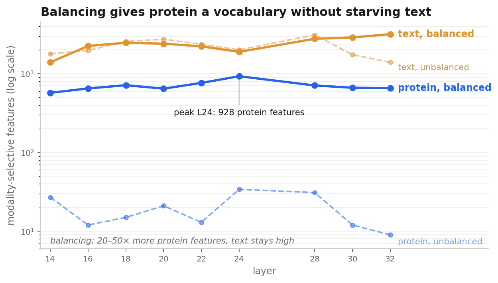
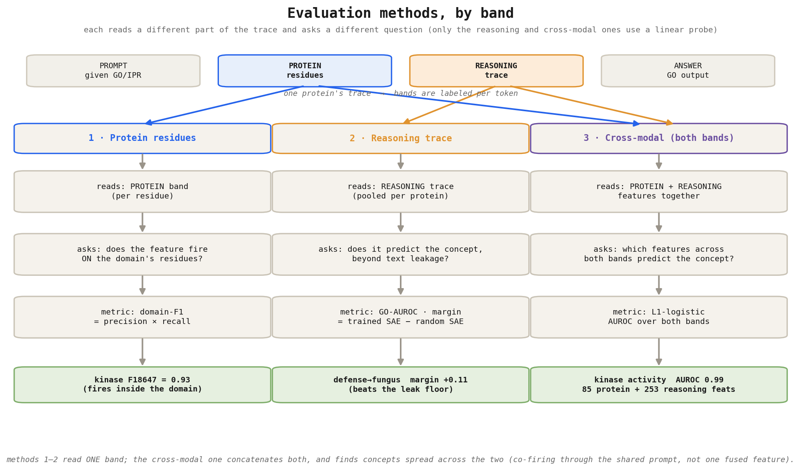
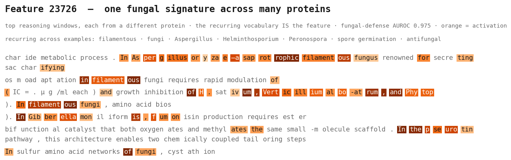

<!-- _class: title -->

# Sparse Autoencoders on BioReason-Pro

### How does a biology foundation model reason about protein function?

Savitha S. · BioReason-Pro SAE recipe

---

# Background and Goal

## BioReason-Pro SFT reasons about a protein in text

- ESM3 residue embeddings and a GO-graph encoder feed into a Qwen3-4B LLM
- The LLM writes a free-text reasoning trace, then predicts GO function
- One residual stream carries three modalities: protein residues, reasoning text, `<go>` slots
- **Goal:** an SAE interpretability recipe for a multimodal bio-LLM
- **Open question:** are biology and text learned as crossmodal, synchronously firing features, or separate ones?
- *Proof of concept: we train & evaluate the SAE over the pre-generated training traces*

---

# Training the SAE on Multimodal Data

## Loss balancing is crucial

- In the natural mix, text is ~80% of tokens and takes over the dictionary; protein gets ~230 features
- Balancing the modalities to ~50/50 lifts protein to 570–928 features per layer, a 20–50× gain
- Without it, the minority modality is not learnt well, and the model is unable to find high quality protein features

---

# Evaluating the SAE on the three modalities

---

# Protein features fire on their domain

## domain-F1, not just AUROC

- A high AUROC can mislead: a feature can score 0.98 and fire outside the domain
- domain-F1 checks localization directly: do the firing residues land inside the domain?
- Of 872 features that detect an InterPro domain (per-feature AUROC), 59 (~17%) actually localize by domain-F1
- Kinase, RRM, and zinc-finger detectors fire on their domain, across many proteins

---

# The SAE discovers many interpretable reasoning features

- About 1,300 reasoning features fire on extended mechanistic phrases, not single words
- They name specific content: translation, RAS signaling, transporters, defense, synapse, mitochondrion, and more
- Each quote is a real reasoning-trace span; every feature is browsable on the dashboard
- These features are high quality (> 30 max activation) and low frequency (< -3 for the log frequency)

---

# How we interpret a feature

## The label is a hypothesis; the AUROC is the check

- We read a feature's top-firing reasoning windows, strip the GO/IPR accessions, and mark the full active phrase
- An LLM (Llama-3.1-70B via NVIDIA NIM) proposes a label, but that is only a hypothesis
- We confirm it with a label-grounded AUROC and by reading the windows; the LLM sometimes misses or overstates

---

# But are they real, or just re-reading the text?

## Checking leakage levels for the reasoning probe

- The trace often names the function, so even a random SAE reads it off the words
- We keep only the margin over that baseline: trained SAE minus random SAE
- 4 of 12 concepts clear it; defense is the cleanest, because its signal is spread across a vocabulary the SAE aggregates

---

# A good reference feature: F36488, interpreted across the text bands

## How does the quality of the reasoning change across these bands?

- Reasoning band: it writes real mechanism — antimicrobial defense, from receptors to hormones to ROS, fungal and bacterial
- Prompt band: the same feature just echoes the GO accessions it was handed
- Answer band: it restates the named effectors and GO terms
- This is why we read the reasoning band, with accessions stripped

---

# Example of a complementary feature for the defense concept: F23726

## Pathogen identity, across many proteins

- F23726 fires on the fungal signature itself: filamentous fungi, Aspergillus, Helminthosporium, Peronospora
- It complements F36488 — identity (which pathogen) versus mechanism (how the defense runs)
- The vocabulary recurring across proteins is what makes it a detector (fungal-defense AUROC 0.975)

---

# A closer look: the antimicrobial-defense feature set we uncovered via probing

## One concept, split across many features

- Not a single defense feature, but a group with distinct jobs
- Pathogen-identity detectors (which pathogen), a shared innate-immune core, and mechanism/signaling features
- F36488 and F23726 above are two of these features, in their mechanism and identity roles

---

# Are the two modalities fused? No.

- SAE-V test (Lou et al. 2025): no synchronous cross-modal feature; the per-feature metric is ≈ 0 everywhere
- Protein and reasoning features do co-fire, but a 2×2 causal test shows the link is prompt-mediated
- Clamp the reasoning feature and the concept appears; clamp the protein feature and nothing changes
- Both track the GO annotation the model was handed (68% already in `go_pred`)

---

# Reasoning features can be causal (to a certain extent)

## Steering

- Clamping a concept's reasoning cluster injects it into a held-out protein's trace (synapse 0.77 at α ≈ 180)
- Feature-specific (a random direction does nothing), and mostly concept-injection, not goal-redirection

---

# Why is there no cross modal fusion?

## A hypothesis: it might be the encoder

- This is a hypothesis, not something we have shown directly, but the encoder is the most likely cause
- SAE-V finds cross-modal features in LLaVA because CLIP aligns its image encoder to text, giving a shared space
- ESM3 is protein-only and not aligned to text, so protein and reasoning likely sit in separate subspaces
- With no shared space, a single fused feature has nowhere to form
- What the SAE does give us is interpretable, localizable, steerable structure

---

# Next steps

1. **Encoder alignment** (Prot2Text-style): put protein and text in one space, then re-test fusion
2. **Fresh generation** on held-out proteins, beyond teacher-forced training traces
3. **Richer modalities:** DNA/codon tokens are more diverse and less orthogonal to text

Open-sourced: training recipe, auto-interpretation pipeline, synthesis scorer, and dashboard

*Code & figures: NVIDIA-BioNeMo/bionemo-interpretability*
